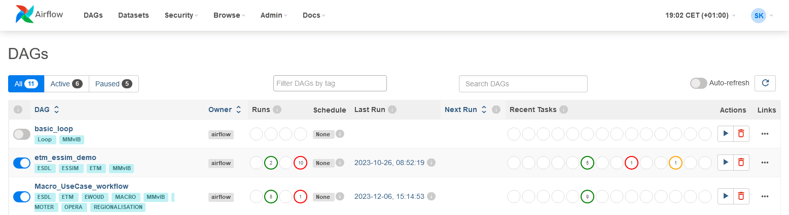
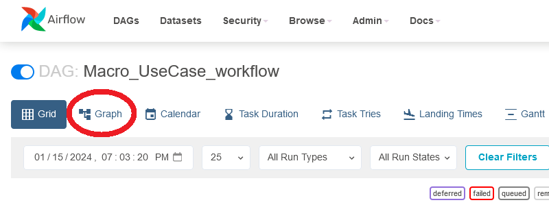
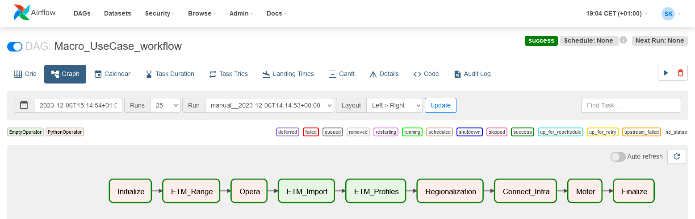
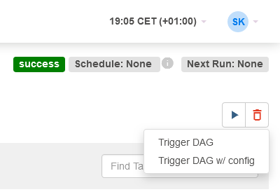
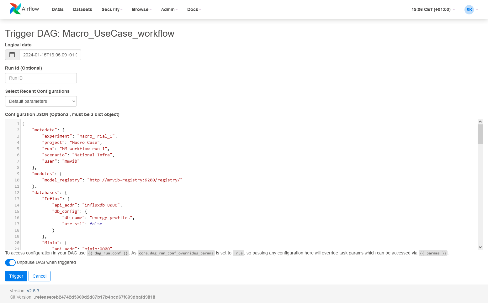
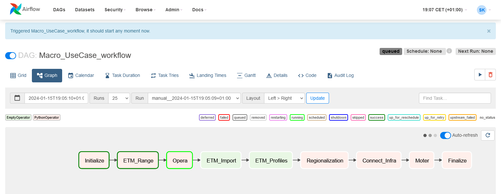
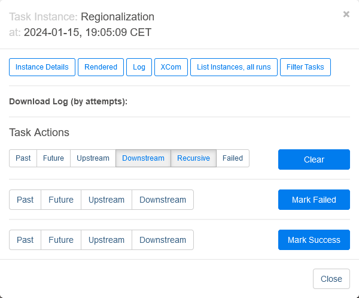

Running a use-case
==================

Go to Airflow on your browser. If you installed according to :ref:`Installation instructions`, you should be able to access it on ``http://localhost:8080``.
Log in using credantials you set up. If you did not, default username and password is ``airflow`` and ``airflow``.

After the log in, you will see a page similar to shown below:

Here, you are seing a list of DAGs and their status.
DAGs (Directed Asyclic Graph) define workflows by collecting tasks that are going to be performed in steps.
In MMviB, workflow of a use-case is defined by a DAG, that is, each DAG in this list define a use-case. 

Click on the DAG of the use case you would like to run.
You will see scheduling information related to the selected DAG on your screen.

Click on the **Graph** tab.
You will see the workflow steps of this DAG.
On top right side of the workflow, click the button with ⏵ (play symbol, or, triangle pointing to right).

You will see a pop-up. Select **Trigger DAG w/ config**.

You will see the following screen.

Paste your configuration and click **Trigger**.
You can find more information about configuration in :ref:`Creating a use-case`.
You can follow the status of the use-case in this screen.

Color of the frames of the boxes will change according to the status.
Meaning of each color can be seen in the legend at the top right side of the workflow.

If you click on a step (task) in the workflow, you will se the following pop-up window.

Here, you can select **Log** to inspect the output of a task that communicates with a Model Adapter.
You can also manually mark the task as failed or succeded.