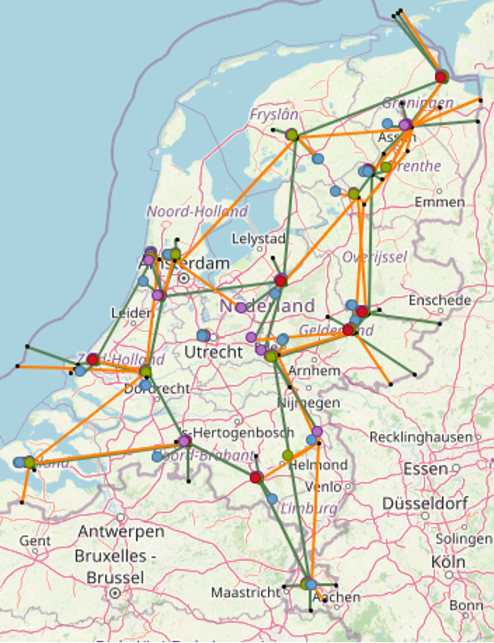

Macro use case - National infrastructure
========================================

1.    Introduction
------------------
 
1.1.	Use case description
^^^^^^^^^^^^^^^^^^^^^^^^^^
Currently models from TSO’s/DSO’s in combination with the ETM are used to determine the impact of energy transition scenario’s on the energy infrastructure. 

However, these scenarios/models have their limitations with regards to: 

* Incorporating changing (economic) conditions (economic consistency vs. technical consistency) 

* Possibilities for optimization (what is optimal with regards to ...?) 

* Optimization of (existing) assets taking into account spatial distribution and network limitations 

Besides, all models have their shortcomings / blind spots. Within a multi-model structure they can compensate for each other’s shortcomings (if done right). 

Through the application of a multi-model structure, existing scenarios can be improved with respect to economic consistency (Opera), scenario optimization with respect to (a set of) KPI’s (Opera), asset optimization (Moter). TSO / DSO models will still provide the necessary asset information for infrastructure planning while the ETM will provide the scenario description and function as communication tool to visualize or adjust scenarios/optimization outcomes. 

This gives stakeholders, such as TSO’s and DSO’s, more insight into the future energy system and enables them to make better / more cost-effective decisions benefitting society. 

1.2.	Models used 
^^^^^^^^^^^^^^^^^

By making the following additions to the existing model structure (models TSO/DSO & ETM) we can: 

* Abstract information from scenarios created by grid operators or policy makers (hourly curves, costs, kpi’s, power, ..) (ETM) 

* Do a cost optimization to create economically consistent scenarios (Opera) 

* Regionalise information and attach it to a grid topology (Regionalisation model & connect infra) 

* Optimize asset dispatch and dimensions (incl. network calculations) (Moter) 

1.2.1. Opera
++++++++++++

OPERA is a technology-rich energy system optimisation model for the Netherlands. Two features that make OPERA especially useful for developing sustainable energy scenarios for the Netherlands are: (1) it covers the complete energy system of the Netherlands and reflects all domestic emissions and types of greenhouse gases; (2) it simulates energy supply and demand, distinguishing different hour series with comparable supply and demand. These features permit the investigation of how to optimally deploy large capacities of intermittent renewable energy, among other things. 

OPERA allows its users to examine the implications of technology diffusion, efficiency improvement and policy interventions that reduce emissions of greenhouse gases. In many studies, OPERA calculates the configuration of the Dutch energy system and the associated emissions, given specific goals and preconditions, at the lowest system costs for specific years (e.g. 2030, 2035, 2040, 2045 and 2050). Although at present OPERA is not a dynamic model, it does consider existing assets by taking into account investments made in previous years and their technical lifetime. In the year for which the optimization is performed, new investments are added to the existing assets if needed. For energy production and use, the model can choose from more than 600 technology options covering the whole technology chain from production to end-use demand services, including technologies that convert primary into secondary sources. The techno-economic data for these options are retrieved from a database containing current data and projections for parameter values in 2030 and 2050, derived from an extensive literature assessment. This techno-economic data has been reviewed by TNO experts for a large number of technologies and summarized in fact sheets (see https://energy.nl/). The fact sheets contain performance and cost parameters for 2030 and 2050 based on learning percentages. For technologies with learning potential for which the learning rate is unknown, an investment cost reduction of 20% is assumed between 2030 and 2050. 

The energy system OPERA computes has to meet the annual demand for: 

* energy services (heat and electricity) of built environment, industry, service sector and agriculture, 

* domestic transport of people and goods, 

* fuels for international transport (bunker fuels), 

* production of industrial products (including steel, aluminium, ammonia, ethylene, methanol, chlorine, salt, ceramics and glass). 

OPERA calculates the primary energy mix and an energy mix for each end-use sector. Fossil primary fuels (oil, coal and natural gas) are assumed to be available at a certain exogenous market price. For domestic renewable energy (solar, onshore and offshore wind, biomass, geothermal energy), a maximum potential applies. In OPERA captured CO2 can be stored or used in industrial processes. A maximum capacity applies for the storage of CO2. OPERA can import refined oil products, biomass, biofuels, hydrogen and electricity at a certain price and within assumed supply limits. Electricity trade with neighbouring countries have been determined using the European electricity market model COMPETES (Lise, Sijm, & Hobbs, 2010). To calculate system costs, OPERA uses a national cost-benefit approach with a discount rate of 2.25% (Werkgroep Disconteringsvoet, 2020).  

Taxes, levies (e.g. CO2 price) and subsidies are not taken into account. Total system costs are the sum of the annualised investment costs, annual operation and maintenance costs, cost for energy transport and costs for imported energy minus revenues from exported energy. OPERA only takes into account policy preconditions arising from the scenarios, such as closing coal-fired power stations before 2030 or a limited use of CO2 storage in the TRANSFORM scenario. 

1.2.2. Energy transition model (ETM)
++++++++++++++++++++++++++++++++++++

The Energy Transition Model (ETM) is an online model which enables users to explore possible future for a specific energy system. The model is open-access, open source, web-based and interactive in its use. Through the use of sliders users can make explicit assumptions and choices about the future of their energy system based on its current situation. Currently the ETM models EU-countries and most Dutch provinces, municipalities and RES-regions. Open data is used to model these different energy systems. 

The ETM is a bottom-up, simulation model. All relevant processes and energy flows are captured in a graph structure which describes all possible routes for exchanging energy between sectors and processes. All relevant sectors and energy carriers of the energy systems are also included. The ETM calculates the yearly energy balance for all energy carriers, and the hourly energy balance for electricity, heat, and hydrogen. The model is run two times, once for a start year and once for every hour of the selected future year. Based on (new) slider settings the model is rerun and supply and demand is automatically balanced on an hourly basis using a merit-module. The results include system KIP’s such as total costs and CO2 emission reduction of the modelled energy system. 

1.2.3. Moter
++++++++++++

*Introduction*
MOTER is an optimization tool for the dispatch of “multi-commodity” energy systems consisting of interconnected electricity, natural gas, hydrogen and heat networks. MOTER was developed in the period 2015-2020 DNV as the calculation engine for the DNV “Energy Transition Simulator” (ETS). The ETS allows for 10-15 participants in a workshop setting to explore decarbonization pathways, from 2020 to 2050, for a simple fictive world (“Enerland”), but with real world techno-economic physics and price models. As the physics engine, MOTER dispatches all production, end use, transport, conversion and storage assets of Enerland energy system at lowest overall cost. The objective of MOTER within the Multi-Model macro case is to add network dispatch and in particular network congestion management to a national “II3050-Mobility” case.

*MOTER scope*
The objective of MOTER (Modeler of Three Energy Regimes) is to find the optimal techno-economic performance of an externally provided multi-commodity energy system, consisting of the topology and capacities of following assets: 

* Primary energy generation via wind turbines, solar PV, geothermal, coal power plants (+CCS), natural gas production and energy import/ export.
* Residential, industrial heat & power demand centers via “smart” end use applications.
* Energy conversion via gas-to-power, power-to-gas, power-to-heat, gas-to-heat, natural gas to hydrogen technologies. 
* Energy transport networks consisting of power cables, gas pipelines, heat networks (+ transformers, compressors)
* Energy storages (battery, pumped hydro, underground gas storage, insulated hot water tanks) 

The output of MOTER is the cost optimal “dispatch” of the flex in the energy system. The term ‘flex” refers to any measure the market can take to reduce supply-demand imbalances, such as:

* Bridging energy supply-demand imbalances in space using passive assets (pipes and cables) in combination with dispatchable assets (compressors and transformers)
* Bridging energy supply-demand imbalances in time using storage.
* Bridging energy supply-demand imbalances in energy type using conversion.

Additional “flex” options:
* Production flex: Ramp-up of flexible sources (natural gas, oil import etc.), curtailment of fixed sources (solar PV, wind turbines, geothermal, etc) according to relative merit orders.
* End user flex: Curtailment and time shifting of energy end use according to relative merit orders (industrial/ residential v. electric power/ space heating). 
* Conversion flex: multi-fuel operations (heat pump+ natural gas back up) 

 storages. Energy carriers can be converted from carrier A -> B via (energy) converters (boilers, electrolyzers, steam methane reformers), Energy “states” (voltage, prerssure) can be altered using (state) converters like compression/ transformers. The “quality” of the energy (mainly  gas calorific value, heat network water temperature) can be changes via (quality) converters like natural gas to hydrogen converters,  gas mixing stations and back-up heaters. MOTER does not yet model AC power “cos phi” or reactive power.

Energy carriers in scope are:

		
Assets in scope are:

*Scalable time granularity: time slices*
A special challenge when working with optimization modeling is the maximum number of assets that can be modelled in combination with properties and time resolution. In other words, the size of the “objects(variables,T) matrix” that will still fit into computer memory and can be solved in acceptable calculation. Macro Energy modelling requires that both the seasonal and the intraday dynamics must be captured by the model. However modeling 8760 hours/year will “blow up” memory usage and severely restricts the number of active objects (distributed and connected in space and including subcategories) that it becomes unsuitability for real world applications. This especially when Monte Carlo methods (“perform a great number of runs with stochastically varied inputs”) are being considered and model runs need to be (very) fast. The solution in MOTER, as is used for Opera, is to reduce the 8760 hours to a define a subset of “time slices” during the year. This because a series of 8760 hours will contain a significant amount of redundant information. In one case study and it was established that with only 16 snapshots (night/morning/afternoon/ evening & winter, spring, summer, autumn) sufficient accuracy (~>90%) may already be achieved, in only a fraction ( <1%) of the calculation time. In order to create a 8760 hour profile from the snap shots a simple ”sample & hold”  reconstruction algorithm is used.

Note that when using “global optimization”, special care has been taken is that the relative order of the snapshots, i.e. causality, is being respected. This because global optimizers calculate all time steps all at once, unlike simulators which run though time step consequently. MOTER has extra time hierarchy information on first priority on the intraday snapshot order first (night, morning, afternoon, evening) and then the days ordering during the year next (jan 1st –> December 31st). This “proper time ordering” is important when optimizing energy storage systems that perform both intraday and seasonal balancing functions.

1.3.	Conceptual framework
^^^^^^^^^^^^^^^^^^^^^^^^^^

*Introduction Macro Energy Modelling*
Transforming a centralized fossil based energy system into a decentralized renewable energy system impact is one of the greatest challenges for our modern society. Essential to the success of this process is the availability of energy models that can guide to the stakeholders what the impact of their investment/ divestment decisions will be on future energy system.

*General modelling approach*
Macro scale energy models tend to follow the structure as illustrated below:

n the future. 

The first step is for the user to construct a “baseline” energy model by configuring the (predefined) supply, demand, storage, transport, conversion assets with data from the information sources. One usually starts with the configuration and validation of the current situation, a baseline, and then modify the configuration into a set of future situations (scenarios).  One of the main challenges for macro energy models is however that the complexity of the real world greatly exceeds the number of objects and interactions a computer model can handle. The detail level will thus need to be (severely) reduced and asset parameter and interactions need to be generalized. When using the ETM in this process, a set of preconfigured objects is presented to the user and the user only has to provide key parameters, usually “relative share of specific category of the total”. A calculation engine will validate the user model configuration and determines the model KPI’s based on generalized interactions between the aggregated assets.  

The next step in the modelling process is to introduce changes , i.e. investments / divestments to the baseline configuration in order to better meet the user objectives, i.e. be more sustainable, resilient and or more affordable in a future moment in time. This step can be performed by human users using an intuitive GUI, stakeholder inputs from workshops, or via optimization models like Opera or TEACOS. Usually scenarios are used to explore the range of possible futures.  

The third step is to perform validations and/ or corrections for the proposed future scenarios on detail levels below the scope of the main simulation and optimization models. This can be a geographical distribution of the assets in combination with the energy network topologies and capacities. To assess the physical impact of the assets on energy infrastructure, dedicated models like PowerFactory, ESSIM or in this project MOTER could be used. Using the insights gained from these detailed models, the proposed investment/divestment plan can be validated or the time line towards achieving the future scenario can be adjusted. 

*Challenges*

1. **Challenge one: model coupling related issues**
Even though the process outlined here for macro energy system modelling may appear straight forward, in reality the process has many challenges. 
A first issue for is the wide range in model scopes and functions such as library functions, intuitive GUI for model configuration, KPI simulation, asset investment optimizations, detailed physical system validations. These model functions do not only require different modelling approaches (database queries, web interface, simulation engine, optimization using CPLEX, etc.) but may also be assigned to different users, with different experience levels and backgrounds, possibly from different legal entities separated by firewalls for sharing commercially sensitive data. The overall macro modelling process can become a highly challenging process of users exchanging data versions (usually via Excel and email) back and forth, introducing unknown amounts of communication, interpretation, translation errors through the model process. Thus the first solution proposed by MultiModel is to introduce ESDL to streamline the communication and the orchestrator to replace the back and forth communication process. 

2. **Challenge two: model resolution related issues**
The second challenge is that models with different scopes (library, global optimization, detailed simulation, …) may also need to work together on different granularity/detail levels. The overall system configuration and optimization models require assets and interactions to be generalized on three main levels: 1) space , 2) time and 3) category (see illustration below).

to be aggregated. The model will need to expand -contract across the detail levels to capture these interactions

Working with models based on aggregated parameters and variables will introduces possible issues that are easily overlooked. As a simple example:  “avg(A x B) ≠ avg(A) x avg(B)” when A and B are aggregate (averaged) values. Why this may be so is illustrated in the example below.   

load A and price B have different correlations on a deeper hourly time level:  industrial site demand and power price is uncorrelated  =>  avg(A x B) = avg(A) x avg(B)= 100x100=10.000 euro/hour , but for the residential market, demand and price are positively correlated and => avg(A x B) > avg(A)*avg(B) =12.500 euro/hour.  

3. **Challenge three: scale**
Another particular challenge in macro energy modelling is that crucial “real world interactions” may take place on detail levels below that of the main models. For example:

	* “Space & Topology”: the distribution of assets in geographical space and the network topology must be included in sufficient detail in order to properly take real world network congestion issues into account.
	* “Time & Uncertainty”:  for storage to be properly modelled the effects of a full year of supply-demand dynamics needs to be included, i.e. winter/summer, week/weekend, day, night. Moreover also a range of possible years (cold/ warm winter, “DunkelFlautes ”, etc) should be included to represent the impact of real world uncertainties and the storage strategy can not know on beforehand what scenario is selected.  
	* Categorization & compatibility. Real world assets can vary greatly in individual properties and applications but will need to be lumped together in “generic containers” in the energy models. This can be a real challenge when models differ significantly in their respective granularity and resolution. See the “electric mobility” example on how a simple and complex model can become “incompatible” as a minor asset category becomes a major energy player.

harging infrastructure” dynamics. The two models may be in agreement as long as electric mobility levels are low and home charging dominates but will strongly diverge as overall electric mobility levels increase and the full market complexity becomes apparent.

  	* Feedbacks & non-linearities. the parameters of generalized objects can be subjects to “real world feedbacks” and are likely not constants during the energy modelling process. Key asset parameters like “investment cost”, ”maintenance cost”, “efficiency”, “behaviour profile”, etc. may depend on the size of the underlying asset (“economy of scale”), size of other assets (“positive and negative cross correlations”) or the size of asset investments/ year. The consequence of all these feedbacks, non linearities and cross correlations is a “real world” macro model is an non-linear model which requires an iterative modelling approach (“configuration initial state -> first optimization->aggregated parameter recalculation -> next optimization -> aggregated parameter recalculation -> etc…  until convergence) or a gradual increment approach (“configuration initial state -> optimization with minor increments->aggregated parameter recalculation -> next optimization with minor increments -> aggregated parameter recalculation -> etc…  until convergence). These approaches are currently out of scope of the existing macro models as they require an MultiModel environment. 

.. image:: macro_conceptual5.png
  :width: 700
  :alt: Examples of real world feedbacks on (assumed) constant parameters: left: initial solar PV capacity is likely installed due south but as network congestion and prices become real factors, additional solar PV investments are more likely to be oriented east – west, resulting in a widening of the effective solar PV production profile.  Right: the relation “pressure drop<-> flow” for gasses in a pipeline follows the quadratic curve. “ voltage drop <->electric current” follows the linear curve.

	* Wide range of uncertainties. Macro energy modelling require a vast number of inputs parameters, all with uncertainties. The general approach is to define a small set of worked out scenarios , usually four covering, covering a “quadrant” of key economic assumptions. However, the full range of future uncertainties (economic, financial, political, technical, social, climate,…) is much larger and would require a Monte Carlo approach.  which in turn require a MultiModel environment.

*Summary macro energy modelling challenges* 

Macro energy models are crucial to the success of the energy transition but the quality of the output or even overall validity is compromised, in uncertain amounts, by the following issues:
	* The coupling of a wide range of model scopes and functions, i.e. information library, asset configuration, performance simulation, investment optimization that require not only dedicated models, but also a wide range of specialist users and possibly information firewalls (illustrated with the generic macro model process diagram). Errors are introduced whenever information is exchanged.
	* Models may differ in space, time and category detail levels. Uncertainties and errors will be introduced in when exchanging information back and forth (illustrated with the electric mobility example).
	* Aggregated parameters and variables may have (hidden) correlations on deeper levels, as illustrated this with the “avg(A*B) ≠ avg( A)*avg(B)” example, resulting in unknown amounts of numerical uncertainties 
	* Asset parameters may not be constant inputs but will be sensitive to the output value of variables. This effect is illustrated with the solar PV profile example. The real world is full of non-linear physics and non-linear scaling effects, but for macro energy system modelling it is assumed that linear relations can be used throughout.  This introduces unknown levels of uncertainty.  
	* A real challenge to macro models is that only endpoints in the future are modelled in extensive detail (2050,..) but not the pathway towards this future. Ideally the future scenario should be “build up” using an incremental investment strategy (i.e. 2025-> 2026-> 2027->…->2050) instead of a “2050 big bang”
	* Macro energy models use a vast range of input parameters with various levels of uncertainties and cross correlations. In addition of a small set of main scenarios also “Monte Carlo methods” should be used. Ideally not ~4 but ~10000 model variants should be run to determine the robustness and standard deviations of the output KPI’s.  Especially when non-linear interactions are involved, the model may give back non-trivial results, and give guidance on investment strategy (“do’s & don’ts”).	  

Multi-Model aims to address the macro energy modelling issues as follows:
	* Model coupling Individual models, owned by different legal entities running on private servers, can now communicate to each other via the internet via “adapters”.
	* Model compatibility ESDL is used as the common communication language, strongly reducing the potential for data translation/ interpretation errors between models.
	* Enhancing scope & resolution Specialized sub-models can check / correct the main scenario models on deeper space/time/category resolution levels or adding simulation/optimization functionalities too challenging for the main model.  
	* Successive approximation Automation of control and communication between the models via the orchestrator, allowing for the use of successive approximation or incremental increases to address the non-linear dynamic with successive approximation techniques.
	* Pathways & Monte Carlo. Automation of control allowing for the running of large numbers of stochastically varied inputs parameters (“Monte Carlo “) or model road maps (2025,2026,…2050) to test for the robustness of model results.

In the next section we will go in to more detail on how ETM, Opera, MOTER, Regionalisation & Connect Infra module aim to work together within the MultiModel framework to achieve the outlined goals. 

2.    Approach
--------------
 
2.1.	Model chain
^^^^^^^^^^^^^^^^^

The model chain represents the flow of data from one model to another. In this case ESDL was mainly used to exchange information between models. Most of the data-exchange is automatically performed by the orchestrator, however, the initialization still requires manual work. Information is exchanged as follows:

1. **Creating a representation of an energy system in ESDL using the map-editor** (manual)

In the map-editor an energy system is constructed on a national level using the following assets and accompanying infrastructure:

	a. Wind turbines
	b. Solar PV
	c. Nuclear power plants
	d. Electricity import
	e. Hydrogen import
	f. Electrolysis
	g. Batteries
	h. Electricity demand transport (car, van, truck)
	i. Hydrogen demand transport (car, van, truck)

These assets merely construct an energy system but does not add any information on this energy system. 

2. **Adding information using existing scenarios in the ETM** (automated)

Based on the created energy system, the ETM can set an installed capacity (rated output power) range for every production asset. This range is based on two existing scenarios with different assumptions on the total installed capacity e.g. for wind or solar power. This is done to allow optimization of the installed capacity at a later stage. The electricity and hydrogen demand do not have a range as this is used as a fixed variable during the optimization. Therefore, the demand is based on only one scenario. To test this use case the II3050 scenarios were used. 

3. **Cost optimization in Opera** (automated)

The power ranges and demands are used by Opera to optimize the installed capacity for every asset based on the most optimal cost scenario. Opera adds the result, the optimal installed capacity, to every asset. 

4. **Changing the power in the ETM** (automated)
The optimized power set by Opera for every asset is imported in the ETM. With this new information, the ETM calculates and adds the marginal costs, full load hours and hourly production and demand curves to every asset. 

5. **Regionalization** (automated)
The energy system consisting of assets with a certain installed capacity, demand, full load hours and marginal costs. This energy system is based on national demands and total installed capacity. For more detailed infrastructural calculations the energy system needs to be regionalized. This process divides all assets into smaller units and attaches a location (e.g. a municipality) to every asset. 

6. **Coupling to infrastructure** (automated)
The regionalized energy system still only consists of a ‘list’ of assets with a location attached to them, however, there is no infrastructure which connects them. Using the ‘Connect-infra’ model, the assets are attached to an existing infrastructure (a mock-up of the future national electricity and hydrogen infrastructure) based on their nearest ‘coupling node’. These coupling nodes represent the transition from a regional electricity/hydrogen grid to the national grid. When all assets are connected to a coupling node, similar assets connected to the same coupling node are aggregated again to simplify the energy system. 

7. **Infrastructure optimization in Moter** (automated) 
Using all information added to the energy system in previous steps, Moter can now perform calculations to optimize the infrastructure and assets attached. Based on the optimization, Moter can give feedback e.g. on the amount of full load hours or max-capacity of assets. 

2.2.	Individual model developments
^^^^^^^^^^^^^^^^^^^^^^^^^^^^^^^^^^^

2.2.1. Orchestrating AIMMS based models
+++++++++++++++++++++++++++++++++++++++

In this multi-modelling project three models are used that use AIMMS  as modelling and optimization environment: Opera, Moter (both in the macro use case) and Teacos (micro and meso use case). While Teacos already moved to AIMMS’ newer cloud environment, Opera and Moter have been developed in an Windows-based AIMMS application, using older versions of AIMMS. This lead to the challenge on how to orchestrate these models and exchange information with the AIMMS environment.
The chosen approach was to wrap the AIMMS executable in a Python application that calls AIMMS using the command line and issue specific command line arguments to load the correct model and start the right AIMMS procedure to run the specific model. Before running the model, the input of the model should be configured based on the input ESDL and after running the model, information should be extracted from the model output and converted back into ESDL.

For those conversions two approaches were developed:

	1. UniversalLink – this Python module converts an arbitrary input ESDL into MySQL tables. AIMMS has the possibility to read these tables and convert the data into the models internal representation. Afterwards, AIMMS updates the MySQL database with the output of the optimization, which is picked up by the Python module to convert the changes back into ESDL. This approach is used for Teacos and Moter.
	2. OperaLink – this Python module directly writes the input ESDL into Opera specific tables in its Access database. This approach was chosen as the impact of the UniversalLink was too high for the Opera model, as specific AIMMS knowledge was lacking for this integration into Opera. The OperaLink approach is therefore less generic, but was needed to have Opera part of the multi-model. Similar to the UniversalLink, the Python module processes the (specific) output of Opera and converts this back into ESDL.

2.2.2. Opera
++++++++++++

As discussed in the ‘Orchestrating AIMMS based models’ section, Opera uses the OperaLink approach to integrate with ESDL and uses a Python wrapper to start the Opera AIMMS model. All this functionality is added to the Opera Adapter that contains a webservice that is used by the Orchestrator to operate models in a multi model.

In the figure below the process to run a scenario in Opera is depicted:

The following steps are performed to run Opera in a multi-modelling environment:

	1. Input ESDL is send to the OperaAdapter by the multi-model orchestrator. 
	2. The OperaAdapter uses the OperaLink to parse the ESDL file and extract the relevant information for Opera. A specific MMvIB scenario is created in the Opera database. This allows Opera to ignore other scenarios and configurations that are also available in the Opera database.
	3. Each asset is converted to an Opera option (a representation of technology option) in the Opera database, including relevant data for that asset, such as its minimum and maximum capacity for production and conversion assets, yearly demand for consumer assets and costs of energy carriers and assets. Based on the available information assets are mapped to an existing Opera technology option or to a generic option.
	4. This information is subsequently written to the different tables in the Opera database (a MS-Access database)
	5. After the pre-processing phase is done, the Orchestrator will instruct the OperaAdapter to run the model. This will use the AIMMS command line to run the model with the right parameters and wait for it to finish its optimization.
	6. After Opera has finished optimizing, the CSV output that comes out of an Opera model run is used to update the input ESDL and serves as the output of this optimization.
	7. The OperaAdapter is informed that the results are ready. 
	8. The Orchestrator is informed of the results and can take this result to the next model in the multi-model.

The example Opera output below shows the optimization of the configurated ranges from two ETM scenarios to a specific value that is optimal for this use case.::

	Found updated capacity for Electrolyzer_b243: 42.0 GW in range [42.00-51.00]
	Found updated capacity for Import_a3ac: 128.60021409 GW 
	Found updated capacity for WindTurbine_6411: 20.0 GW in range [20.00-20.00]
	Found updated capacity for PVPark_37e4: 57.60000001 GW in range [57.60-66.92]
	Found updated capacity for NuclearPowerPlant_f521: 4.56731593 GW 

This output (in ESDL) is subsequently fed to the regionalization and connect infra models as first step to add network infrastructure as input for Moter.

2.2.3. Moter
++++++++++++

For the MultiModel project a special version of MOTER was created that is ESDL compatible and can be controlled via an adapter. The MultiModel MOTER operates as follows:

.. image:: macro_adapter_motor.png
  :width: 700
  :alt: Schematic of the MultiModel / ESDL compatible MOTER version

* A input.esdl xml file is received
* The “Uniform_ESDL_AIMMS_link.py” script unpacks the .esdl file in the MySQL database
* The esdl configuration data is imported into the Aimms environment 
* A ESDL-> MOTER parser creates a validated MOTER configuration from the ESDL data and writes the MOTER case to the MOTER database (local MSAccess)
* MOTER loads and runs the case (via the procedure MMviB_read_run_write) and writes results back to the MOTER database.
* The MOTER->ESDL module load the MOTER results and writes the results to the ESDL database.
* The “Write_to_esdl.py” script creates the output.esdl file.

All steps can also be performed automatically or manually for testing purposes and the results can be inspected via information pages on supply-demand, network, storage and converters.

sports not converted from ESDL to MOTER.

2.2.4. ETM
++++++++++

The ETM translates scenario results into ESDL using the ETM-ESDL app. This app is accessible through an online interface (https://esdl.energytransitionmodel.com/api/v1/ or https://beta-esdl.energytransitionmodel.com/api/v1/ ). The app can currently perform 4 actions:
1. Create a scenario: Generate an ETM-scenario based on an ESDL-file 
2. Create a context-scenario: Generate an ETM-scenario based on two separate ESDL-files (current energy system vs. future energy system) 
3. Export a scenario: Change an ESDL-file based on one or more ETM- scenario(‘s)
5. Add KPI’s: Add KPI’s to an ESDL file based on an ETM- scenario

In the macro use-case the ETM-ESDL app uses the ‘create a scenario’ function and the ‘export a scenario’ function. Both functions existed before the start of this project, however, beforehand it was not possible to add the amount of information that was necessary in this use case and it was not possible to determine a range based on two scenario’s. Furthermore, the app was not yet connected to the orchestrator enabeling automated multi-model communication. This required the built of an extensive adapter which could, in a flexible and sustainable manner, direct the ETM-ESDL app to perform multiple actions. For more information, you can find the app here: https://github.com/quintel/etm-esdl#readme. 

2.3. 	Multi-model infrastructure and configuration (orchestrator)
^^^^^^^^^^^^^^^^^^^^^^^^^^^^^^^^^^^^^^^^^^^^^^^^^^^^^^^^^^^^^^^^^

The figure below shows the workflow of this use case in  the orchestrator (Apache AirFlow):

Each step in the workflow requires configuration (e.g. what input to use and where to write output). This configuration is done in a JSON file:

.. image:: macro_airflow3.png
  :width: 700
  :alt: Part of the JSON configuration of the Macro use case

For each step or task a configuration is defined. The ‘app_id’ refers to the ID of the model adapter that is used in each step. This ID is searched for in the Adapter Registry to receive information about where to find the adapter of that specific model such that it can be used by the orchestrator to be run. The configuration of each adapter is described in more detail in the source code repository of the adapter.
In Airflow you can use this configuration to start a workflow:

.. image:: macro_airflow4.png
  :width: 700
  :alt: Configuring the workflow in the Apache Airflow orchestrator

When the Trigger button is pressed, the workflow will be started. The border around each step shows the status of the task, e.g. dark green means a successful model execution.

During Workflow execution the operator can look at the logs to see the progress of each task. Below a screenshot of the Opera model log output, showing that it is configured and running.

Apache airflow also allows you to see how long each task takes when executing a workflow using a Gannt chart: 

3.    Results
-------------

3.1.	Overview results orchestrator
^^^^^^^^^^^^^^^^^^^^^^^^^^^^^^^^^^^

As the starting point of the macro use case, a simplified national model is created in the ESDL MapEditor. The visualisation is shown below:

The ESDL contains several important characteristics:

	* Connectivity information: how are the different assets connected and which carrier is used in each connection
	* Which type of assets are used (PowerPlant, WindTurbine, PVPark, Battery, Electrolyser, MobilityDemand, Import)
	* Costs for utilizing production. E.g. the costs for deploying wind is defined as follows in the ESDL Mapeditor:

ETM adds ranges to the ESDL that is input for the Opera optimization. These ranges are defined based on the configuration of two ETM scenarios, and are added to the ESDL as a constraint for the optimization. E.g. the wind park should be optimized between 10 GW and 15 GW 

Opera optimizes based on costs and removes the ranges and updates the power attribute of the assets. E.g. for the excerpt of the output of Opera for the WindTurbine, the optimal power is updated to 15 GW:

The regionalization module subsequently takes the national model and regionalizes it to municipalities. How it is regionalized is fully configurable and for this use case the power and energy values are (automatically) regionalized by the number of inhabitants, based on CBS data. This gives the following visualisation in the ESDL MapEditor:

If you zoom in you can see that every asset in the National model is regionalized for each municipality, but without any connections and infrastructure, as that is the next step.

*Connect Infra* 

For connecting the assets to the infrastructure of Motor, a infra-ESDL is needed that describes this infrastructure. This was provided by DNV and is shown below:

It shows two carriers: electricity (green) and hydrogen (orange). When running the ConnectInfra model, a (large) configuration is required to map the assets of a municipality to a node in the infrastructure. Additionally a mapping is required that maps the carriers of the National model to the carriers of the infrastructure model (i.e. Moter distinguishes between transport infrastructure (high voltage) and distribution infrastructure (medium voltage). Additionally the ConnectInfra model aggregates multiple municipalities where possible when assets of the same type are connected to the same node in the infrastructure. This reduces the amount of assets in the ESDL and makes the optimization in Moter faster.

After the infrastructure is connected to the regionalized assets Moter can be run as a next step in the Workflow. The output of the Moter ESDL is similar to the left figure, but with optimized infrastructure which is not visualized in the MapEditor. For the actual results of the run see the next chapter about Moter.

3.2.	Results Moter
^^^^^^^^^^^^^^^^^^^

In order for MOTER  to be able to process the optimized, regionalized ESDL, the following modifications were made: 

	* Commodity X: in ESDL a nuclear or coal fired power plant is a converter of an external (X) commodity to an internal commodity (Hydrogen, Electricity, etc). In MOTER, coal fired power plants were however considered production assets. The discrepancy was fixed by adding “XtoPower” converters, a “X” production site and a X transport network to MOTER.  
	* Transport power rating MOTER has the added option to ignore the power rating of the transport lines. This because in the network template the power rating may be unknown or accidentally set to zero. A cable with a (unintentional) maximum power rating of zero will seriously disrupt the network performance.  Therefore it is best to first run a scenario first without cable and pipe power ratings, to check the validity of the scenario, before adding network congestion.
	* Transport Conductivity issue MOTER has the added option to ignore the conductivity of the transport lines. The electric conductivity of a power line is determined by the cable gauge, number of conductors and length. The key issue here is that although ESDL can communicate pipe diameters, it is not yet able to communicate cable gauges & number and /or cable conductivity. MOTER now uses default conductivity ratings for all power cables but MOTER also has the added option to skip this aspect of the network simulation and just focus on maximum line ratings.
	* Allowed topologies As it turns out there is room for network topology interpretation conflicts between MOTER and ESDL. In MOTER the network nodes are considered fundamental building blocks and production, consumption are added to the network nodes as attributes. In ESDL the Assets are fundamental and the network connections are considered attributes of the assets. In MOTER it is possible to add a producer, battery and a consumer to the same node or couple a producer directly to a consumer. This it not allowed or desirable within ESDL. However, in ESDL it is possible to provide a “virtual pipe / cable” or “logical connection” between an Asset and a network node (just assign an asset with a network node x km away as the inport or outport to use). MOTER however does not understand “virtual cables or pipes”. See illustration on restrictions on allowed network topologies.     

	* Time Slices. Like Opera, MOTER must use “time slices” to greatly reduce the complexity of 8760 hours. It is only just possible for MOTER to process the full 8760 hours of an un-regionalized ETM/ Opera output on a conventional PC using <10 GB of internal memory. For a regionalized case a maximum of 288 time slices / year is manageable.  Using the un-regionalized ETM as an input, the definition of the time slice definition can be fine tuned to minimize their impact on the FullLoadhour output KPI of highly dynamic assets like wind / solar production and batteries. This was outside the scope of this work, although it was observed that with ad hoc selected time slices (48 slices; 12 days/year , 4 hours/day) the FullLoadHours KPI for solar typically displays A ~10% uncertainty, whereas wind does not change more than ~2%. 

	* Merit orders. MOTER requires very detailed information on flexibility merit orders and more than currently is available or can be communicated by ETM via ESDL. Therefore an additional interface was created to manage the manual user input of the merit order information MOTER requires.

*MOTER Performance*

The following  MOTER performance was observed for the regionalized ETM output (“macro 16”)
	* Macro case: 425 assets in total
	* 46 producers, 29 consumers
	* 17 storages, 293 transports
	* Mode=224 time slices (28 days, 8 hours/ day)
	* 3 solver iterations to manage on-linear physics
	* Total solve time: 45 seconds 
	* Peak memory use: ~2 GB

Hardware and software specifications were: 
	* intel i5 1600 MHz
	* AIMMS 4.10 (old version due to licencing issues)
	* MOTER model type: LP (linear Programming)
	* CPLEX 12.6.2 , mode  “concurrent”

The main concern for LP models like MOTER is the large amounts of internal memory they can require, not so much the CPU intensity. LP models benefit hardly from multiple CPU cores as the LP model cannot be split into branches or sub tasks. CPLEX does offer a “concurrent mode” which does add a little extra performance (in “concurrent mode” CPLEX it starts multiple, independent solves on a model, using different strategies for each. Optimization terminates when the first one completes). Solver times of around 1 minute are considered reasonable as a MMviB starting point and a little more performance may be gained by increasing server specifications or reducing the number of time slices. Ideally the number of transport assets should be scaled back in the future, provided that MOTER can be modified in such a way that it can understand “virtual connections”.

*Scenario analysis*

The chosen macro scenario was taken from an ETM II3050 scenario, and contained  renewable production (solar, wind), mobility consumers (electric and hydrogen mobility, CAR, VAN, BUS, TRUCK), batteries,  conversion (nuclear power, electrolyzer). The striped down ETM macro case, coupled to a fictive infrastructure, is thus not a realistic and/or balanced national scenario and the macro case only value is to validate the flow of data through the various models. MOTER was however able to solve the macro case (some production assets set to zero to create more interesting MOTER performance), with following results:

*Network modelling*

The figure below illustrates the macro network as reconstructed and dispatched by MOTER. In this example artificial congestion has been created along a HV power line (red).

Note that care must be taken to not overload MOTER with congestion (i.e. a fictive case where all cables and pipes are too small) as this leads to an energy system without any clear solution and CPLEX may need to be “times out” or it might take indefinite amounts of time (hours) to solve.    
 
*Supply-demand total*

The overall macro scenario is characterized by the challenge to supply the very high peak demand from the Electric and hydrogen charging infrastructure, supplied by the batteries:

The relatively oversized battery storage is used as intraday storage and deliver the weekly peak demand and as seasonal storage and absorb the massive wind overproduction in November.   

*Supply-demand specific*

.. image:: macro_adapter_moter6.png
  :width: 700
  :alt: Intermittend solar production (top) and the high peak from the vehicle charging (electric and hydrogen) 

*Storage*

Because of the use of time slices, special care needs to be taken to model the causal relations between time slices (ordering &hierarchy) between the time slices accurately. MOTER must first decide for a specific modelled day Di , how to use storage for the modelled intraday hours, and then repeat the net daily charge /discharge choice for all following days between Di and Di+1.  The result is a fill rate following a “step ladder” as shown below:

The net daily charging/discharging choice for modelled day “Di” must be repeated until day “Di+1” arrives, resulting in fill level jumps between the days.

The batteries are loading all day to provide the peak in mobility demand. Moreover the batteries nett accumulate or discharge to balance seasonal imbalances (the batteries in the macro case are oversized because they only serve mobility demand).

*Conversion*

The missing links to establish balance between supply and demand are the hydrogen imports (producers) and nuclear power plants and the electrolyzer commodity converters. In MOTER the default behaviour for the imports, coal & nuclear power plants is to be idle and ramp up according to the needs of the rest of the energy system.  

4.    Conclusions and recommendations
-------------------------------------

4.1.	Lessons learned
^^^^^^^^^^^^^^^^^^^^^
* Arguably the biggest benefit of the Multi-Model approach is the approach enables model developers to work together at all. Models like ETM, Opera, MOTER have a long development history, are highly complex and can now only be worked by original developers. This if they are still available or successors are comfortable in meddling with the original code. Any attempt to integrate any two mature models would require developers from both sides to spend significant amounts of time, which they do not have, to understand how their own model and the other model works, before even considering an approach to add functionality to the models without breaking them. This provided that the models involved are fully open source and do not contain special approaches or proprietary information that developers may be reluctant to share with competitors. So basically, any conventional form of model integration will be very challenging under current real world commercial conditions. In the MultiModel approach, the main effort is to adapt models to read/ write ESDL and equipped with an adapter and the developers can then focus purely on their own model and focus all integration efforts on resolving ESDL input/output issues. This greatly facilitates the creative process and open communication and gives all parties involved a way forward in taken models to the next level.

* MOTER was able to optimize a ~400 asset system, using 200 time slices within ~45 seconds using 2 GB of RAM. The challenge for MOTER as the number of assets in the future will increase lies in memory management, as LP optimization benefits less from multiple CPU cores.  

* The focus of the ESDL communication is on the list of assets and their key attributes (capacity, catagorization) and the “FullLoadHour” KPI. However also static context information needs to be communicated and ESDL was only partly used for this. The issues and work arounds were:

	* MOTER requires extensive detail on production and consumption increase/ decrease merit orders. For example: which customer to curtail first to relieve congestion: car, van or truck? And prioritise electricity over hydrogen?  ETM and OPERA do not yet have all this information or cannot yet use ESDL to communicate this information. The current solution is a MOTER GUI for users to manually input this information. 
	* ESDL allows for “logical connections” (i.e. assign an asset a network connection node that is many km away) and this is currently an issue for MOTER. The solution is to avoid logical connections in the network template. 
	* No clear approach yet on models communicating the profile information. The current approach taken by MOTER is to retrieve all the ETM profiles from repositories and manually assign the production/consumption categories with the appropriate profiles.

* The map-editor is crucial to ‘ignite’ a multi-model run by creating the first ESDL, working with more complex energy systems therefore requires a large amount of time.

* There are many IT challenges along the way seeing that all models work completely different: are open-source/not-opensource, run on different programs, ….. Coupling and communicating between such different models is therefore first and foremost an IT / dev challenge and much time and expertise need to be dedicated in order to get it to work.
* This project has been a challenge as the goals where quite ambitious (for the budget):
	* Three use cases that are very different in nature are supported by the infrastructure.
	* There is a lot of IT involved in getting a multi-model working and that knowledge was not always available or lost when people left the project. It is therefore important that multiple people work together and share the knowledge they gained.

4.2.	Reccomendations
^^^^^^^^^^^^^^^^^^^^^

Arguably the biggest benefit of the Multi-Model approach is that the approach enables model developers to work together at all. Models like ETM, Opera, MOTER have a long development history, are highly complex and can now only be worked by original developers. This if they are still available or their successors are comfortable enough in changing the original code. Any attempt to integrate any two mature models would require experienced developers from both sides to spend significant amounts of time to understand how their own model and the other model works. This all before even considering an approach to add functionality to the models without breaking them. This all provided that the models involved are fully open source and do not contain proprietary information that developers may be reluctant to share with competitors. So given all these preconditions, any conventional form of model integration will be very challenging and it is not a stretch top claim that established models will hit dead ends in their development. 

However the MultiModel approach, the main effort is in adapting models such that they can read/write ESDL and equipped with an adapter. Once that hurdle is taken the developers can focus purely on resolving any ESDL input/output issues flagged by the other model users, using the ESDL reference documentation and various toolkits. This approach greatly facilitates the communication between developers and gives all parties a way forward in addressing the future energy system challenges.

With the MultiModel MACRO case we have demonstrated a way forward on how a scenario model like  ETM can be enhanced with investment decision support, geographical information and network dynamics. The next issues to work on:
* Expand the list of assets,
* Add heat networks, natural gas, oil, E-fuels,…
* Create a more realistic set of network templates 
* Create tooling for inspecting results (like Mapeditor) 
* Add road map, scenario batch processing and/or Monte Carlo functionality 
* Make the MMviB platform “monkey proof”
* Service delivery models (open source, premium customers)

ESDL provides a good base for multi-model communications, however we need to develop:
* A standardized way of working and communicating with ESDL (e.g. which units / descriptions / process do we use while communicating)
* An easy way to generate an ESDL
* (More) IT expertise is essential in future projects.

