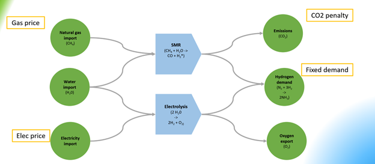
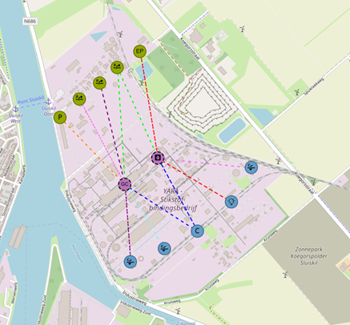
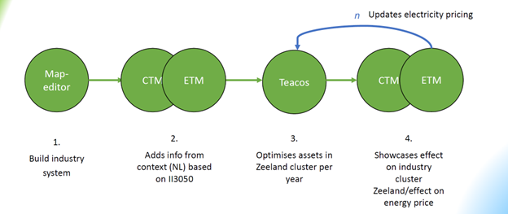
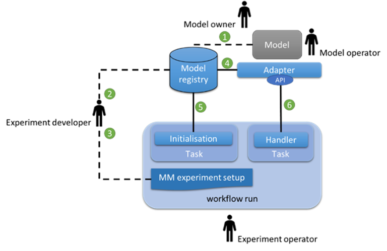
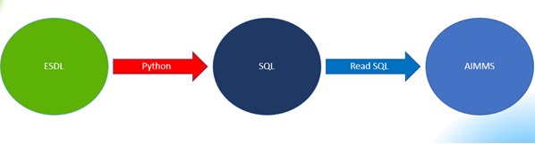
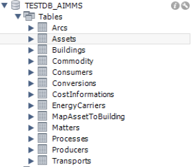

Meso use case report
====================

1.    Introduction
----------------------------
 
1.1.	Use case description
^^^^^^^^^^^^^^^^^^^^^^^^^^^^^^^^

The base idea of the meso use case was to model part of the Netherlands energy system on a provincial level. More specifically the South-Western province of Zeeland was selected since there is major industry in Zeeland but the complexity is rather limited in the sense that the number of large industrial parties is low.

After an initial exploration it turned out that the involved models (see paragraph 1.2) had modelled industry in Zeeland in one way or the other. Although it seemed promising to see whether these model variants of Zeeland could be coupled with each other, it became clear that this was really not an option since the models had a large disconnect in terms of scope, detail level, inputs and outputs. If this route would have continued, the remainder of the project would have been filled with mapping information between the models and making assumptions on disconnects. Instead of going that direction it was decided that the focus should be on a simpler, stylised model.

Figure 1. Schematic view on meso case

In figure 1 the schematic setup of the meso case can be seen. Although not explicitly modelling the whole industry in Zeeland we assume that the major business challenge in Zeeland is the production of Hydrogen (H2) and whether that will be made by either electrolysis or by and SMR (Methane Steam Reforming) process. The first one can be considered green with no (or limited, depending on the generation of electricity) CO2 emissions. The latter being the traditional process where besides Hydrogen a significant amount of CO2 is created. In the meso use case, the models are coupled to come up with a system that can decide on whether the electrolysis or the SMR process is the preferred approach based on the costs involved in the processes. The most relevant variable costs are the Gas cost and a CO2 emission penalty for the SMR process and the electricity cost for the electrolysis process. Besides the variable costs, also the CAPEX investments for installing the units are taken into account. 

Figure 2 The meso use case as plotted on the Yara company in Zeeland

1.2.	Models used 
^^^^^^^^^^^^^^^^^^^^^^^^^^^^^^^^^^^^^^^^

The following models were involved in the meso use case:

*CTM*

The Carbon Transition Model (CTM) is a tool to explore pathways to zero emissions for the Dutch industry as well as future industries that produce synthetic molecules (from carbon, water and electricity). Industrial activity is modelled according to historic public data and has been validated. The user can explore a future year by making changes to a reference 'base year' scenario. The model then provides information on changes to emissions, costs, energy and feedstock, technology choices, infrastructure and much more.

The model covers the entire Dutch industry. The largest energy intensive industrial sites are modelled using a bottom-up approach. This includes steel, refineries, fertilizer plants, large base chemical plants including steam crackers, industrial gases and methanol production, some inorganic chemical plants for salt, chlorine and petrochemical catalyst production as well as waste incineration plants. The remainder of Dutch industry has been modelled using a top-down approach based on national energy statistics and site specific emission data.

The model gives information about these industries at the national level (The Netherlands), industry sector level, cluster level (Rotterdam, Zeeland, Groningen, Noordzee Kanaalgebied, Chemelot and Cluster 6) and site level.

*ETM*

The Energy Transition Model (ETM) is an online model which enables users to explore possible future for a specific energy system. The model is open-access, open source, web-based and interactive in its use. Through the use of sliders users can make explicit assumptions and choices about the future of their energy system based on its current situation. Currently the ETM models EU-countries and most Dutch provinces, municipalities and RES-regions. Open data is used to model these different energy systems. 

The ETM is a bottom-up, simulation model. All relevant processes and energy flows are captured in a graph structure which describes all possible routes for exchanging energy between sectors and processes. All relevant sectors and energy carriers of the energy systems are also included. The ETM calculates the yearly energy balance for all energy carriers, and the hourly energy balance for electricity, heat, and hydrogen. The model is run two times, once for a start year and once for every hour of the selected future year. Based on (new) slider settings the model is rerun and supply and demand is automatically balanced on an hourly basis using a merit-module. The results include system KIP’s such as total costs and CO2 emission reduction of the modelled energy system. 

*TEACOS*

TEACOS is a mathematical optimization tool for mid- to long-term strategic investment analysis. The tool is designed to assist in the investment decision making process. It aims to answer the following questions:

*	In which (decarbonization) opportunities to invest?
*	What is the optimal investment timing?
* How much to invest?

By answering these questions, TEACOS provides credible, affordable and competitive transition pathways towards a low carbon energy system. TEACOS is completely data driven. Because of this, it can be applied in any industrial sector and on any scale.

TEACOS models the supply chain as a network. In the network, nodes represent locations or (production) units, and the connections between the nodes (arcs) represent transport of commodities between the nodes. Additionally, possible adaptations to the network infrastructure can be modelled as investments. The model selects the best combination of investments and calculates the corresponding product flow such that either the Net Present Value is as high as possible, or the costs are minimized.

One of the major strengths of TEACOS lies in answering ‘what-if’ questions: i.e. ‘what if CO2 emission costs rise?’, by defining several scenarios in which certain assumptions are altered: i.e. a scenario with fixed CO2 emission costs and one where CO2 emission costs change over time.

1.3.  Multi-model aspects showcased
^^^^^^^^^^^^^^^^^^^^^^^^^^^^^^^^^^^^^^^^^^^^
 
1.3.1. Conceptual
+++++++++++++++++++++++++++++

There are different conceptual aspects that are challenging in the Meso use Case:

* Communication between the models
*	Convergence of choice between either the electrolysis or SMR process based on the electricity price
*	Multi-period

*Communication between models*

There are 3 models involved in the meso use case: CTM, ETM and TEACOS. CTM and ETM had been coupled before in a previous project. Since that was an already working coupling, it was decided that this approach was preferred instead of creating a completely new interface. Since the CTM/ETM combination needed to be communicating with TEACOS as well it was decided that there would be an ESDL file connection between ETM and TEACOS. This implied that both ETM and TEACOS should be able to read from and write to ESDL file format. Since a similar approach was taken in other use cases this seemed a logical way forward.

*Convergence*

In the meso use case there is a iterative loop between the three involved models, where one model uses input from the previous model to calculate a result. In case of the meso use case TEACOS is the model that calculates the optimum processing configuration based on the electricity price. It is possible that the choice of processing configuration (depending on size) has an impact on the electricity price and that therefor a different choice of processing configuration should be chosen. As soon as the same processing configuration is chosen twice in a row, the model can be considered converged. Since in normal circumstances the size of an electrolysis unit in Zeeland would only very marginally influence the general electricity price in the Netherlands, it is not expected that this convergence would be a problem. In theoretical cases where the demand of Hydrogen and therefor the processing capacity is hugely increased, this could lead to alternating processing configurations. 

*Multi-period*

Thirdly, the multi-period aspect. There are several aspects with regard to the handling of time. ETM uses historic hourly profiles for solar and wind in their calculations. With these hourly profiles insight can be gained on the expected balancing in the system over an entire year. Although TEACOS can handle hourly time periods as well, it is in the meso casus setup in a configuration where a time bucket is the size of a year, meaning that there is no insight of differentiation of what happens within that year. This leads already an interesting situation within MMvIB on how to handle differences in time. ETM calculated results for a given situation over an entire year. In the beginning the project team started out with a scope of a single year. TEACOS would have 1 time bucket, ETM could do a regular time slice of 1 year. However, in real life decisions are not made based on data or expected results of a single year. Investments are often spread out in time and result in a transition path towards the future in order to achieve future goals. It made sense to see how this notion of multiple years would fit in this Meso casus multi model environment. The idea would be that the optimisation would still be an optimisation but not over a single time bucket of a year but over multiple time buckets of a year. Initially this proved to be a challenge because up till then all information was based on a single year ESDL file. TEACOS would now need information of multiple years and there was a choice to be made. Either extend the ESDL to contain multiple years or go for multiple ESDL's of a single year. It turned out that a single ESDL for multiple years would require too much effort on various sides in order to get it running so the decision was made to go for multiple ESDL files that would each contain information of a single year. The interface with TEACOS needed to be adapted because TEACOS would now use multiple ESDL's instead of 1 in order to get a complete multi period model run going and output multiple ESDL's as a result. The runs for ETM would still be based on single ESDL files but would be run multiple times for each of the individual years.

1.3.2. Technical problem description
+++++++++++++++++++++++++++++++++++++++++++++

The MMvIB platform seeks to automate complex multi-model workflows in order to support decision making. However, models used in the meso case such as CTM, TEACOS and ETM do not inherently work together. In addition, the location that these models are hosted on may vary across experiment and deployment. In order to provide a robust platform, a large range of circumstances must be supported, and models must fit together like building bricks.

To address these challenges, the platform employs a modular architecture that facilitates seamless integration of a wide range of models. By using a standardized interface and data format, the platform enables smooth communication between the individual models. Models are treated as modular components that can be easily assembled and reconfigured as needed. Furthermore, the platform incorporates a flexible hosting infrastructure, allowing infrastructure and models to be deployed across various locations and environments. 

This versatility ensures that the platform can adapt to a wide array of circumstances, providing decision-makers with a reliable toolset to navigate complex scenarios efficiently.

2.    Approach
----------------------------

2.1.  Model chain
^^^^^^^^^^^^^^^^^^^^^^^^^^^^^^^^^^^^^^

The micro use case model chain is depicted in a flow diagram in figure 3. The steps are as follows:

1.	In the ESDL MapEditor, the initial setup of the energy system is modeled. The assets for electrolysis and SMR are added as optional assets. This information is stored in an initial ESDL file.

2.	The combined CTM/ETM model provides context in terms of electricity prices of a reference year. Optional assets are considered as not operational. This information is added to the ESDL file.

3.	TEACOS loads the ESDL with optional assets and energy price and calculates the optimal process configuration, using economic parameters as an input. The result is an ESDL file where the status to the assets is changed from optional to either enabled or disabled.

4.	CTM/ETM calculates the impact of the new process configuration on the electricity price and updates this information in the ESDL file

|       n.	Based on the new electricity price TEACOS may reconsider the initial choices for the investments. If that happens the electricity prices is reconsidered again. If not, the model loop has converged.

Figure 3 Schematic view on the process in the meso use case

The results of this model loop are the following:

* Optimal processing configuration based on the initial gas price, CAPEX numbers, CO2 penalty and calculated/updated electricity price. 
* Latest calculation of the electricity price given the chosen processing configuration
*	Investments (in EUR)
*	CO2 emissions (in kton CO2)

Please note that step 1 of building the system in the Map-editor is a manual step. The others are done by the MMvIB orchestrator.

2.2.  Individual model developments
^^^^^^^^^^^^^^^^^^^^^^^^^^^^^^^^^^^^^^^^^^^^

*CTM*

**CTM REST Adapter**

The CTM REST Adapter is written as a python class whose methods can be called to automatically make the CTM API calls that the project needs. The results of these calls are then automatically used in the CTM ESDL adapter to write the CTM data in the ESDL file, which is then directly uploaded in MINIO through the TNO machine’s localhost.

The CTM REST Adapter can be found under the /Kalvasta/MMvIB directory in GitHub. The Adapter’s single most important piece is the ctm.py file (under /MMvIB/tno/ etm_price_profile_adapter/model). This file contains a CTM class with the following attributes:

*	Request()
*	Initialize()
*	Run()
*	Results()

**CTM ESDL Adapter**

The CTM ESDL adapter attempts to create a fully adaptive ESDL reading and writing applet. The specific adapter functions can be found in /MMvIB/specific_adapter/f.py. The file f.py (also called specific adapter in MMvIB contexts) reads/writes assets from/into an ESDL file based on a csv file. Each asset will have its own csv file specifying for each attribute which API interface name it should read to (on the CTMref_r column) and which name it should write to (on the CTMref_w column).

*ETM* 

The Energy transition model (ETM) has a separate app which translates ESDL-files into slider settings and vice versa. Separate from the ETM-ESDL app an adapter was created to incorporate the ETM in the orchestrator and meso-case multi-model. In this multi-model the ETM provides an average electricity price based on slider settings provided by the existing model connection with the Carbon transition model (CTM). The app is available online at: https://esdl.energytransitionmodel.com/api/v1/. For the meso-case the export_esdl function was used as well as the kpis function. 

*TEACOS*

**Model developments**

There are two sides to the developments made with regard to TEACOS. The adapter and the model logic interpreter.
 
**Adapter**

The TEACOS-adapter reads and translates ESDL files to the AIMMS cloud-based TEACOS and writes the results back into an ESDL file. The adapter is built using Flask REST API. 
The API is available at http://localhost:9300/openapi. TEACOS uses its own API that can only be accessed by requesting an account at the Quo Mare office, where IP whitelisting is necessary and an environment (.env) file is provided with a username to both the TEACOS cloud and the TEACOS SQL database. 

The TEACOS Adapter is built by using the main function. The adapter API contains the following functions: 

*	Request() --> Request the local host for an instance of TEACOS to assign a run to 
*	Initialize() --> Initializes the run Requested 
*	Run() --> Runs the ESDL Translation, the TEACOS API, and then the translation back to ESDL.  
*	Status() --> Returns the state of the API. 
*	Results() --> Contains the API Success or Error code. 
*	Remove() --> Deletes the requested instance of TEACOS. 

More detailed documentation of the TEACOS adapter is added in Appendix B.

**Model logic interpreter**

When the relevant information is passed on through the adapter, TEACOS has the relevant data in memory. However, what is not passed on is an explicit topology of what needs to be modeled. There is logic needed that couples all that information in a network structure. In ESDL, it is more or less assumed that the energy system is a network as well but works at some places with implicit references. For example (only illustrative) the electricity grid is always present and the electricity price is a general setting for electricity pulled from the grid.  In TEACOS the grid is as much an asset as an electrolysis unit and the price for electricity coming from the grid needs to be specified explicitly. You could possible define multiple “ grids” all with different price structures. 

TEACOS is also expecting capacities and cost in a certain unit of measurement, in order to have a mathematically stable problem to solve and to prevent scaling issues. In ESDL some units of measurement were omitted or different than expected so some sort of interpretation had to be given. It was challenging to create a full logic that delivered a consistent TEACOS model.

2.3.  Multi-model infrastructure
^^^^^^^^^^^^^^^^^^^^^^^^^^^^^^^^^^^^^^^^^^

In order to achieve this, first and foremost models need a common way to exchange and parse data. For this ESDL was used as a common language for models, which saw a good fit as ESDL supports inclusion of custom KPIs with relevant metadata. 

Next, a common communication methodology is required so that models can communicate results with each other. For this the Handler – Adapter protocol was designed. Each task is linked with a handler that specifies a generic protocol such as REST or MQTT, and each model-specific Adapter is able to interpret such requests and communicate these to the model in a standardised way. 

In order to configure such workflows, the researcher executing the experiment needs to provide a configuration for the experiment. This configuration includes what types (and versions) of models each step requires and their configuration. The system dynamically allocates requested models via the model registry, to which model adapters are registered. This method allows for registration of secure external models, local models and even models running on different clusters or operating systems within VMs. This results in a very wide range of support for model applications across operating systems and networks.

Finally, intermediate and final results are stored in an inter-model storage solution. For this the standardised S3 protocol was used, which allows for storing large amounts of varied and unstructured data. This allows models to not only retrieve and store ESDL files, but also store any other files such as separate KPIs, logs, and more.

The multi-model infrastructure used for the micro case consists of the following components:

**Core Infrastructure**

*	Airflow

  *	Airflow Webserver

  *	Airflow Infrastructure

  *	Kubernetes/Celery Cluster
 
*	Model Registry
 
*	Inter-Model Storage

  * MinIO
 
**Model Infrastructure**

*	TEACOS

  *	TEACOS REST Adapter

  *	TEACOS Infrastructure

  *	TEACOS Model (Proprietary Cloud-Native)
 
*	CTM 

  *	CTM REST Adapter

  *	CTM ESDL Adapter

  *	CTM Model

  *	Existing CTM-ETM coupling
 
*	ETM 

  *	ETM Adapter – Integrates the ESDL app into the orchestrator.

  *	ETM-ESDL app – translates ESDL into ETM slider settings and vice versa.

  *	ETM Model (consisting of several separate repositories/models) – Calculates or communicates slider settings. 
 

2.4.  Orchestrator configuration
^^^^^^^^^^^^^^^^^^^^^^^^^^^^^^^^^^^^

Experiments within the MMvIB platform require two components:

*	Workflow Specification
*	Experiment Configuration
 
The workflow is a static definition of what the experiment is about. For the micro use case, this means that it specifies the looping behaviour between TEACOS and ESSIM, as well as calculating the KPIs in the final step. 

The configuration on the other hand defines how the experiment should be conducted. For example, which exact model version or end-point to use, how that model should be configured and where the experimental results should be stored. 

This division allows for large scale and parallel experimentation by running the same workflow horizontally or vertically over different configurations. Using the Airflow API, parameter spaces can be searched to find optimal solutions to complex multi-model problems by providing robust configurations for the workflow that is being studied.

3.	Results
----------------------------------------

On a functional the following results have been achieved:

* We were able to create a scenario in the MapEditor that represented a very stylised version of the Zeeland hydrogen production problem. 
* This scenario was exported from MapEditor to an ESDL file format
*	CTM/ETM added information to the ESDL file on electricity pricing
*	The resulting ESDL file could be read and optimised by TEACOS and a resulting file could be written back to ESDL format including the decision to be either “ENABLED” or "DISABLED” for all the optional assets
*	This ESDL file could be picked up by ETM and an updated electricity price was calculated.

This all worked in an automated sequence via the Apache AirFlow orchestrating software in February 2023. All parties involved participated in providing adapters that made the communication possible. TNO performed tests in a TNO controlled environment and reported that the sequence worked.

Positive side there is the starting of the individual models and the communication between the models via ESDL was proven and working. This in itself is a major result!

On the individual models the following results were achieved:

*	The ETM-ESDL app can provide the average electricity price based on all slider settings through the ESDL language. 
*	The ETM-ESDL app can provide KPI’s, such as the:

  *	Source of electricity production
  *	Total costs
  *	Total CO2 emissions
  *	CO2 reduction (compared to 1990)

*	The general ETM adapter makes sure the ETM-ESDL app can be called from the orchestrator to provide the average electricity price and adds the KPI’s
*	ESDL file representing the hydrogen production of fertilizer producer Yara, which can both be read by TEACOS and interpreted by the CTM
*	The ability for the CTM to read and write in ESDL
*	The ability for the CTM to communicate with the orchestrator
*	TEACOS was able to construct a full model topology based on an ESDL file.
*	Both on input and output the conversions from and to the ESDL file were handled by the TEACOS adapter.

4.    Lessons learned
------------------------------------------

The following lessons were learned:

*	At this point in the development, coupling models into a multi-model framework requires case-dependent work and forms of communication. This means that adapting the multi-model framework to other projects or topics in the future will still require a considerable amount of time. 
*	Developing skills are key for a successful project, especially in these early stages. 
*	Communication between model can partly be solved by ESDL but also requires standardization (definitions and standard naming) of carriers, assets, levels of detail or profiles. 
*	Building a complete ESDL representation of a complex model like the CTM is not feasible. ESDL files containing industrial sites should be simplified and generalized, such that multiple sites can make use of the same ESDL structure. This way, sites become more of a black box as complex internal structures are left out
*	Most problems that were encountered (and time we lost fixing it) with TEACOS had to do with units of measurement (UoM). There are multiple ways in ESDL to specify an UoM with a flow, but all of them are depending on text interpretation and often these UoM's are not specified because some sort of default is assumed. For example, if an investment cost for a PV panel is specified, it can be that it says “100” with a certain max size, say 15 MW. For the interpretation in TEACOS it is not immediately clear whether this 100 is 100 Euro, 100 kEuro, 100 MEuro, or even 100 Euro/MW, 100 kEuro/MW, or 100 MEuro/MW. Even if the UoM's are specified there are still different ways to interpret the numbers, e.g. 100 MWh can be 100 Mwh per day but also 100 MWh per year. A common set of rules of behaviour around the use of UoM's would be nice.
*	Although we are able to make the multi-model work, it is almost certain that if we use a slightly different energy system with a different topology, that we might run into problems pretty soon. Nothing that is not fixable but up to now, that is the case.
*	When you are working on a multi model, there is often interaction with other parties. Other parties have other priorities and availabilities. What is important for us at this moment might not be important at this time for them, if they are available in the first place. As a result, there is often quite some delay over the total scope of work to get it working. Because of the exploratory nature of this project this is understandable. If this were an operational project, it would put pressure on the timeline if this is not aligned and formalised upfront.
*	There was a lot of time lost with working in the TUDelft environment. All the access rights needed to be arranged from there while at the same time all the technical knowledge was within TNO. Even people from TNO did often not have the correct access rights to get something working. 
*	On QuoMare side we wanted to get some experience on working with Apache AirFlow but it seemed almost impossible to:
  
  *	Get access to Apache AirFlow
  *	Get rights to see input files
  *	Get rights to see the correct DAGs
  *	Change the DAGs
  *	Upload the changed DAGs to the correct folder
  *	Run the DAGs
  *	See the correct output files

Individual steps seem small and could eventually be done but it was up to the end not possible to go through the total sequence without needing external help because we didn't have access ourselves.

5.    Conclusions & recommendations
-------------------------------------------------------

From the work done in the meso case we can draw the following conclusions:

*	Multi-models can provide interesting insights into energy system dynamics but also require in-depth knowledge of each separate model and their dynamics to be able to understand the entire multi-model.
*	Coupling of models like Teacos, CTM and ETM is possible but does require a lot of manual finetuning in order to work in a meaningful way. ESDL does provide a means of communication. However, it does not provide a strict format in which this information structured
*	Scenario models like ETM and CTM can be used for optimization when coupled with an optimization model like TEACOS
*	In general the work involved requires not only people with modelling knowledge but also people with in depth technical IT knowledge. This was not clear at the beginning of the project.
*	Having a positive energy in the group, helps a lot to move things forward.

The parties combined have the following recommendations:

*	Further standardization of communication between models (on top of ESDL) can reduce the amount of (future) work significantly and make multi-models more flexible and adaptable for users. 
*	Adding the option for the orchestrator to read/write assets other than the SMR and electrolyzer: In order for MMvIB’s aim of creating a complete multimodelling framework to be truly successful, the orchestrator should direct all of the models’ actions. As such, it would be more proper if it was the orchestrator to input what kind of assets need to be read and written. This would mean adding a ESDLconfig to be the input of the read_inputs and write_inputs specific functions. As of now, the read_inputs and write_inputs are simply told by the CTM adapter to read/write only the yara smr and electrolyzer.
*	Shared ESDL standards for structuring information can help different models communicate with reduced ‘manual finetuning’
*	For far-reaching integrated coupling of models, a standardized communication method does not suffice. Certain definitions and assumptions among models should be aligned during development of the models
*	Make sure the project starts with actual work sooner than it did now. The first halve year most people were waiting for something to happen.
*	Split the project in a conceptual phase for showing the possibility, and an operational phase where this is expanded to an actual real live case.
*	Create awareness and common ground for UoM definitions. 
*	When getting a multi model going it need to be properly logged what you need to do in order to get access to ALL the relevant systems and to get it running.
*	Create sessions where people are physically together working on something. The time that was spent waiting on other parties was enormous. Even with the best intentions from all parties involved.
*	The personal aspect played a part in getting delay in the process. It would be advised to get at least 2 people involved with a similar knowledge level from all sides such that one person changing roles, being on holiday, sick, whatever, does have a less significant impact for other parties to continue.
*	Improve payment terms for commercial parties. The current rate really makes this a low priority project and that has an effect on the timeline and the results that are achieved.

Appendix A: CTM and ETM scenario and session ID’s
-------------------------------------------------------

Initiating the MESO case model run from the orchestrator requires either ETM + CTM scenario or session ID’s to be sent to the CTM adapter.

Scenario ID’s corresponds to a fixed scenario which needs to be made and saved by a user in the ETM and CTM respectively. From the perspective of the orchestrator, a scenario is unchangeable (read-only). The only function of a scenario ID is to make a session ID which is the exact copy of the corresponding scenario, but which is changeable (read and write).

If a model run is initiated using scenario ID’s, the CTM generates both ETM and CTM session ID’s which are copies of the scenario ID’s. These sessions then undergo modifications resulting from model interactions in the CTM-ETM-TEACOS model chain. For example, the CTM synchronizes with the ETM by changing the ETM session such that it now corresponds with the CTM session. Then, after the ETM-TEACOS interaction has passed, TEACOS modifies the CTM session etc. etc.

After the MESO model loop has been completed, the CTM returns both ETM and CTM session ID’s to the orchestrator. These session ID’s are now in the ‘end-state’ of the model loop while the scenario ID’s have not changed.

Therefore, if an experimenter wants to do multiple iterations of a MESO case model run, he/she should use the ETM/CTM session ID’s returned by the CTM for the next iteration and not the scenario ID used for the initial model run.

The following CTM and ETM scenarios could be used for a MESO case experiment test run:

**ETM scenario ID’s:**

*	13578: a scenario of an energy system in which Yara is expected to opt for a elektrolyser
*	13579: a scenario of an energy system in which Yara is expected to opt for an SMR
*	13580: a scenario of an energy system in which the choice between an SMR and an elektrolyser is expected to alternate when multiple iterations of the model run are performed

**CTM scenario ID’s:**

*	SC-a1035b76fb350515: a scenario that should be used in tandem with ETM scenario ID 13578 or 13579
*	SC-0c70f3d36d8e68c3: a scenario that should be used together with ETM scenario 13580

However, you can create your own scenarios by visiting https://energytransitionmodel.com and https://carbontransitionmodel.com/ (you need to make an account first)

Appendix B: TEACOS adapter documentation
-----------------------------------------------------------

Introduction
^^^^^^^^^^^^^^^^^^^^^^^^^^^^^^^^^^^^^^^

This describes the technical inner workings of the TEACOS-adapter that is built for connecting the Quo Mare’s Techno-Economic Analysis Of Complex Option Spaces (TEACOS) tool to the infrastructure set up in the MMVIB project (https://multi-model.nl/). 
This adapter is based on the Aimms-adapter created by TNO. 
The input and output of the adapter are Energy system description language (ESDL) files where the documentation can be found at https://energytransition.github.io/. 
The model-specific TEACOS-adapter is available on GitHub: https://github.com/MultiModelling/teacos-adapter. 
 
Brief description 
^^^^^^^^^^^^^^^^^^^^^^^^^^^^^^^^^^^^^^^^^^^^^^^^^^^^^^^^
 
TEACOS is a long-term Optimization tool. It optimizes the transition pathways to obtain the highest margin or lowest cost over a given time horizon, based on the Netto Present Value. It detects the most profitable investments over time and locations, given a predefined supply/demand scenario and potential environmental constraints. 
 
The TEACOS-adapter reads and translates ESDL files to the AIMMS cloud-based TEACOS and writes the results back into an ESDL file. The adapter is built using Flask REST API. 
The API is available at http://localhost:9300/openapi. TEACOS uses its own API that can only be accessed by requesting an account at the Quo Mare office, where IP whitelisting is necessary and an environment (.env) file is provided with a username to both the TEACOS cloud and the TEACOS SQL database. 
 
Adapter functions
^^^^^^^^^^^^^^^^^^^^^^^^^^^^^^^^^^^^^^^^^^
 
The TEACOS Adapter is built by using the main function. The adapter API contains the following functions: 

*	Request() 

  *	Request the local host for an instance of TEACOS to assign a run to 

*	Initialize() 

  *	Initializes the run Requested 

*	Run()

  *	Runs the ESDL Translation, the TEACOS API, and then the translation back to ESDL.  

*	Status()

  *	Returns the state of the API. 

*	Results()

  *	Contains the API Success or Error code. 

*	Remove()

  *	Deletes the requested instance of TEACOS. 
 
All the functions are standard except the run function, which will be explained in depth.  

Config 
^^^^^^^^^^^^^^^^^^^^^^^^^^^^^^^^^^^^^^^^^^^^
 
A .env file is provided by Quo Mare in the form of the .env.template with a TEACOS account and password included. 
 
The input of the adapter can be delivered in two distinct manners:  
 
*	Via MINIO, this is the Inter-model storage (IMS) of the MMVIB infrastructure and requires additional information in the .env file. 
*	Locally, the inputname and outputname configuration must be adjusted in the function start ‘start_aimms_model’ in the teacos.py file. 
 
 
Input Requirements 
^^^^^^^^^^^^^^^^^^^^^^^^^^^^^^^^^^^^^^^^^^^^^^
ESDL describes a full energy system as a node-arc structure, where Producer nodes supply energy to the Consumer nodes, possibly through Transport and Conversion. 
The Assets with an Optional State may be selected by TEACOS to obtain the lowest cost for the energy system. 
 
The following Sets with parameters that are required by the TEACOS-Adapter: 

*	Producers:

  *	Id: Unique 
  *	Display Name: Technology 
  *	State: OPTIONAL or ENABLED 
  *	Power: in W 
  *	Profile: attached to OutPort 
  *	Year: Parameters can be time dependent 

*	Consumer:

  *	Id: Unique 
  *	Display Name 
  *	State: OPTIONAL or ENABLED 
  *	Profile: attached to InPort 

*	Carriers:

  *	Id: Unique 
  *	Display Name 
  *	Year: Parameters can be time dependent 
 
*	Import Producers (for all carriers):

  *	Id: Unique 
  *	Display Name 

*	Export Consumers (for all carriers):

  *	Id: Unique 
  *	Display Name 
 
*	Arcs:  

  *	Id: Unique 
  *	Outport To InPort of Assets 
  *	Specified Carrier 

*	Costs: 

  *	Investment costs: Euro/Watt for OPTIONAL Producers (peak capacity) 
  *	Marginal cost: Euro/MJ per Carrier for Import 
  *	Year: Parameters can be time dependent 
 
Additional Supported Sets:

*	Conversions 

  *	Id: Unique 
  *	Display Name 
  *	State: OPTIONAL or ENABLED 
  *	Efficiency or InputOutputRelation 

*	Transport 
*	Marginal cost: Euro/MJ for Consumers 
 
Run function adapter
^^^^^^^^^^^^^^^^^^^^^^^^^^^^^^^^^^^^^^^^^^^^^^^^^^^^
 
The run procedure does the following steps in order:

1.	The  Translator class ‘Universal Link’ is created and the ESDL is parsed to the TEACOS MySQL server. 

  a.	The input ESDL is picked up in Minio or by local path in the inputname specified in ‘start_aimms_model’. 

  b.	The translation is done in function ‘parse_esdl’ by converting all the sets with parameters into three sets:  

    i.	SetOfTables: per table a single string with the name of the table. 
    ii.	SetOfAttributes: A tuple of all the attributes included in the specific table. 
    iii.	SetOfValues: A tuple of value sets of every instance included in the input. 

  c.	The specified SQL database is refreshed and filled with the previously listed sets (See Figure 2). 

2.	The TEACOS API is called with the TEACOS credentials included. 

  a.	This creates additional tables in the MySQL database with the TEACOS results. 

3.	The Translator Class ‘Universal Link Back’ is created and the data is retrieved from the server and written into an ESDL file in the ‘_generate_esdl’. 

  a.	The new file is saved in the specified outputname specified in ‘start_aimms_model’ 
 
  

Figure 5: The Translator functionality

Figure 6: The Generated Tables 
 
 
Results: 
^^^^^^^^^^^^^^^^^^^^^^^^^^^^
The following results in the output ESDL: 

*	All the OPTIONAL assets are transformed in either ENABLED or DISABLED. 
*	The Enabled producers are scaled to the Teacos optimal. 
*	KPIs are added to the system.  

