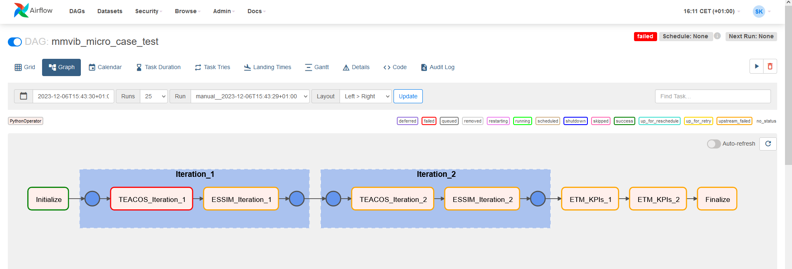

Micro use case report
=====================

1. Introduction
---------------

1.1. Use case description
~~~~~~~~~~~~~~~~~~~~~~~~~

In the micro use case, the MMvIB approach has been applied on a local
scale, for a business park.

In recent years, the energy transition on business parks has
accelerated. Increased energy prices and changing markets stimulate
entrepreneurs to invest in energy efficiency and renewable energy, and
policy makers act as they realise business parks play a key role in
reaching climate targets. A collective (business park) approach is
beneficial in this transition.

The micro use case is intended to support decision making on business
parks by using a multi-model approach to calculate long-term optimized
investment paths towards a sustainable business park.

As a case study, the business parks Welgelegen and Slabbecoornpolder in
the municipality of Tholen have been used. Business on these business
parks are united in the Regional Energy Community (REC) Tholen, which
has the mission to collectively invest in renewable energy measures
towards a CO2 neutral or energy positive business park. As for a lot of
other business parks in the Netherlands, current grid congestion is a
barrier for electrification and renewable electricity measures for
Welgelegen and Slabbecoornpolder.

The energy system for the case study is simplified to provide a
technical proof of concept for a business park MMvIB multi-model chain.
The multi-model chain has not been tested in a decision making process,
as the scope of the model chain is not detailed enough yet.

1.2. Models used
~~~~~~~~~~~~~~~~

To cover all aspects of the problem scope given by the Tholen case
study, 6 models/tools have been coupled in this use case:

1. The ESDL MapEditor is a map-based scenario editor, using the Energy
   System Description Language (ESDL) to describe the energy system.

2. The Energy Potential Scan for business parks (EPS) is a calculation
   tool which estimates the energy use for each business on a business
   parks, and the potential for energy saving and PV measures.

3. The Energy Transition Model (ETM) is an interactive energy scenario
   tool, which can be used for countries, regions and municipalities.

4. A new agent-based model (ABM) has been developed in this use case to
   simulate human investment behaviour.

5. Techno-Economic Analysis Of Complex Option Spaces (TEACOS) is a
   long-term optimisation tool that calculates the optimal investment
   paths for an energy system.

6. The Energy System Simulator (ESSIM) is a tool that simulates network
   balancing and the effects thereof, in an interconnected hybrid energy
   system (described in ESDL) over a period of time.

1.3. Multi-model aspects showcased
~~~~~~~~~~~~~~~~~~~~~~~~~~~~~~~~~~

A number of multi-model challenges are addressed in the micro use case,
both on a conceptual and a technical level.

1.3.1.Conceptual
^^^^^^^^^^^^^^^^

There are three key conceptual aspects that are challenging in the micro
use case:

1. Convergence of energy flows between models (ESSIM – TEACOS)

2. Agent-based versus global investment optimum

3. Multi-period

First of all, the **convergence**. When using multiple models there is
always a chance that several models calculate similar results but in a
different way. This occurred between ESSIM and TEACOS, where TEACOS, in
the configured setup, determines how many PV panels need to be installed
and calculates an electricity flow from a group of PV panels to
users/companies that have a demand for electricity, on a yearly basis.
In ESSIM the electricity flow is calculated based on a given PV panel
capacity, on hourly basis, using a profile of sun intensity for a
historic year. With a provided demand profile of the user/company, ESSIM
can take into account the disconnect in timing between supply and
demand, where TEACOS on a yearly basis cannot. On the other hand, TEACOS
can determine the best investment size given the properties of the rest
of the energy system and set the PV panel capacity for ESSIM to work
with. In this way there is added value to combine the two models. It is
not trivial that the two models end up with the same electricity flow
between PV panels and users/companies.

The way this has been solved is the following:

1. TEACOS runs and determines the optimal investment in PV panels. This
   is based on 100% of the capacity going to users, nothing to grid.

2. ESSIM uses the TEACOS result as the given capacity in PV panels and
   calculates how much of this electricity (in %) can actually be used
   by the users and how much will be absorbed by the grid. This % is
   then passed back to TEACOS

3. TEACOS recalculates the optimum investment with the given addition of
   the useful % electricity and recalculates the optimum investment.

4. Steps 2 and 3 are repeated until either the % doesn't change anymore
   or the optimum investment remains the same. Convergence has then been
   reached.

Theoretically there is no guarantee that it will converge, but in
realistic cases it is expected that it will.

Secondly, the **agent-based versus global investment optimum**. The
thesis work of Menghua Prisse [1]_ covers this topic extensively, so we
will here suffice with a short notion. TEACOS will determine the
mathematical optimal solution for the energy system that is presented.
In the micro use case this is determining the optimum investment size
and resulting electricity flows for the entire business park. In this
case the objective value for TEACOS to optimise on, is the total cost
for the entire business park lumped together. This means that it is
possible that the result is not optimal or even beneficial for some of
the individual businesses in the business park. The agent-based approach
tries to mimic real live, where there is no full transparency between
all the businesses in the business park and each business will take
decisions that are most beneficial for their own situation. The struggle
for the agent-based approach is when there are general constraints for
the entire business park e.g. a grid-limitation for all businesses
combined. TEACOS can deal with that when it is optimising the total
business park, agent-based modelling will have to find a way around
that. It is possible to run TEACOS for individual businesses in order to
make the optimal decision for that business and as such use it as a part
of the agent-based model.

Thirdly, the **multi-period** aspect. There are several aspects with
regard to the handling of time. Both ESSIM and ETM use historic hourly
profiles for solar and wind in their calculations. With these hourly
profiles insight can be gained on the expected balancing in the system
over an entire year. Although TEACOS can handle hourly time periods as
well, it is in the micro casus setup in a configuration where a time
bucket is the size of a year, meaning that there is no insight of
differentiation of what happens within that year. This leads already an
interesting situation within MMvIB on how to handle differences in time.
ETM calculated results for a given situation over an entire year. ESSIM
can theoretically handle a longer time period. In the beginning the
project team started out with a scope of a single year. TEACOS would
have 1 time bucket, ESSIM an hourly profile for 1 year and ETM could do
a regular time slice of 1 year. However, in real life decisions are not
made based on data or expected results of a single year. Investments are
often spread out in time and result in a transition path towards the
future in order to achieve future goals. It made sense to see how this
notion of multiple years would fit in this micro use case multi model
environment. The idea would be that the optimisation would still be an
optimisation but not over a single time bucket of a year but over
multiple time buckets of a year. Initially this proved to be a challenge
because up till then all information was based on a single year ESDL
file. TEACOS would now need information of multiple years and there was
a choice to be made. Either extend the ESDL to contain multiple years or
go for multiple ESDL's of a single year. It turned out that a single
ESDL for multiple years would require too much effort on various sides
in order to get it running so the decision was made to go for multiple
ESDL files that would each contain information of a single year. The
interface with TEACOS needed to be adapted because TEACOS would now use
multiple ESDL's instead of 1 in order to get a complete multi period
model run going and output multiple ESDL's as a result. The runs for
ESSIM and ETM would still be based on single ESDL files but would be run
multiple times for each of the individual years.

1.3.2.Technical problem description
^^^^^^^^^^^^^^^^^^^^^^^^^^^^^^^^^^^

The MMvIB platform seeks to automate complex multi-model workflows in
order to support decision making. However, models used in the micro use
case such as ESSIM, TEACOS and ETM do not inherently work together. In
addition, the location that these models are hosted on may vary across
experiment and deployment. In order to provide a robust platform, a
large range of circumstances must be supported, and models must fit
together like building bricks.

To address these challenges, the platform employs a modular architecture
that facilitates seamless integration of a wide range of models. By
using a standardized interface and data format, the platform enables
smooth communication between the individual models. Models are treated
as modular components that can be easily assembled and reconfigured as
needed. Furthermore, the platform incorporates a flexible hosting
infrastructure, allowing infrastructure and models to be deployed across
various locations and environments.

This versatility ensures that the platform can adapt to a wide array of
circumstances, providing decision-makers with a reliable toolset to
navigate complex scenarios efficiently.

2. Approach 
------------

In this chapter, the model chain workflow, the individual model
developments, the infrastructure aspects and the orchestrator
configuration for the micro use case multi-model are described.

2.1. Model chain
~~~~~~~~~~~~~~~~

The micro use case model chain is depicted in a flow diagram in figure
1. The steps are as follows:

1. The EPS calculates an ESDL representation of the energy system of the
   business park, based on available data for all buildings and
   businesses, and standard energy demand profiles.

2. In the ESDL MapEditor, potential energy measures can be added as
   optional assets.

3. The ETM provides energy prices to the ESDL, based on energy scenario
   data.

4. TEACOS loads the ESDL with optional assets and energy price
   scenarios, and calculates the optimal investments (in time) from a
   business park perspective, using economic parameters as an input.

5. As TEACOS bases its decisions on yearly energy demand, and energy
   production and demand profiles vary over time, ESSIM is used the
   simulate the resulting (ESDL) energy system with an hourly
   resolution, optimizing dispatch and including flexibility.

6. The import and export electricity flows (between the business park
   and its connection with the grid) and potential grid congestion are
   sent back to TEACOS for an adjusted optimization run.

7. The TEACOS optimization and ESSIM simulation are iterative. When the
   energy flows between TEACOS and ESSIM have converged, the results are
   sent to ETM and ABM.

8. ETM calculates the impact of the investments on the system KPI’s on a
   municipality level.

9. ABM uses the TEACOS (business park) investment optimum as an input
   for agent-based decision making. The agent-based decision for the
   businesses are compared with the TEACOS business park optimum.

|image1|

Figure 1. Micro use case multi-model chain.

The results for the optimal investment path(s) for the business park
are:

-  Local energy production (in MWh)

-  Investments (in EUR)

-  Energy costs (in EUR/year)

-  Direct and indirect CO2 emissions (in kton CO2)

Steps 3-8 are part of the MMvIB orchestrator, the other steps are still
manual.

2.2. Individual model developments
~~~~~~~~~~~~~~~~~~~~~~~~~~~~~~~~~~

**ABM**

The Agent-Based Model is a relatively very simple simulation model
developed in Python using the Mesa and Mesa Geo packages to simulate
investment behaviour in the optional assets based on the ESDL-file. The
key outcome this model aims to represent is the number and distribution
of solar panels that are purchased by agents in a single simulation run.
The Mesa Model aims to replicate the real-life decision-making processes
that influence the acquisition of optional assets in an abstract manner,
considering financial (i.e., costs and ROI) and social factors (i.e.,
how agents are influenced by each other). The decisions made by the
agents are written back into the ESDL-file. The results of the ABM are
presented in the thesis Coupling for multi-models [2]_.

| **ESDL**
| The Energy System Description Language (ESDL) is a standardized
  language used to describe the structure, components, and
  characteristics of energy systems. It is designed to facilitate the
  exchange of information between different energy models and tools,
  promoting interoperability and collaboration in the field of energy
  system analysis and planning.

During the development of the MMvIB project, it was identified that some
models needed access to energy profiles but there was no standardised
way in providing this. Instead, ESDL was updated by the team at TNO to
be able to embed and link to energy profiles directly in the ESDL file.
This ensured that models within the multi-model chain could have access
to the same set of energy profiles.

| **ESSIM**
| The Energy System Simulator (ESSIM) models the dynamics of network
  balancing within energy systems over specific timeframes. Using the
  energy system defined as ESDL as its input, ESSIM computes the ideal
  schedule for flexible producers, analyzing its impact on emissions,
  costs, network load, and other relevant factors.

The primary adaptations for ESSIM during the MMvIB project were the
development of the ESSIM adapter based on a REST API interface, the
ability to read and utilise profiles embedded within an ESDL file and
the inclusion of calculated KPIs directly into the ESDL file during the
operation of multi-model workflows.

**ETM**

The Energy transition model (‘ETM’) works with a separate app
specifically built to enable the translation of ESDL-files to
ETM-scenario’s and vice versa. For this use case three features have
been added to the app:

1. Electricity price (curve) additions to the ESDL based on an ETM
   scenario

2. Creating a context ETM scenario based on two ESDL files with more
   local information

3. Adding KPI’s to an ESDL-file based on ETM scenario results

The first feature enables the addition of a future average electricity
price based on the hourly electricity price in a given scenario with a
given end-year. For example, for 2030 the ‘Klimaat en Energieverkenning’
(KEV) can be used to provide an average electricity price. The second
feature enables users to understand and project the impact of certain
choices made by the business park owners on a larger scale, such as the
municipality. If the business park makes certain choices with regard to
energy production or heating this can be aggregated and projected onto
the amount of local energy production or mix of heating technologies in
the municipality (or province, country, etc.). This enables efficient
and fast communication between stakeholders on multiple levels of scale.
Lastly, the KPI feature can quickly showcase the differences and results
of energy plans in the business park.

**TEACOS**

The TEACOS developments that were specifically done within the MMvIB
project are the following:

-  Creating code for reading in ESDL files and converting the
   information to an SQL database

-  Creating code for reading in the SQL database information and storing
   the information in local TEACOS parameters in memory

-  Creating and implementing logic for interpreting the data and turning
   it into a consistent TEACOS model that could be optimised

-  Optimisation procedures were already in place so those did not need
   to be created

-  Code was created for writing back results out of the optimisation to
   the SQL database format

-  Code was created for writing the combination of input/output
   information back to a new ESDL format file

-  The whole sequence was wrapped in an API that could be called
   externally

The work that was involved in these previous bullets was initially done
for the single time period scenario. Later on, all the steps were
revisited and extended in order to be able to handle both single and
multiple time period scenarios.

**General TEACOS information**

TEACOS is a mathematical optimization tool for mid- to long-term
strategic investment analysis. The tool is designed to assist in the
investment decision making process. It aims to answer the following
questions:

-  In which (decarbonization) opportunities to invest?

-  What is the optimal investment timing?

-  How much to invest?

By answering these questions, TEACOS provides credible, affordable and
competitive transition pathways towards a low carbon energy system.
TEACOS is completely data driven. Because of this, it can be applied in
any industrial sector and on any scale.

TEACOS models the supply chain as a network. In the network, nodes
represent locations or (production) units, and the connections between
the nodes (arcs) represent transport of commodities between the nodes.
Additionally, possible adaptations to the network infrastructure can be
modelled as investments.

The model selects the best combination of investments and calculates the
corresponding product flow such that either the Net Present Value is as
high as possible, or the costs are minimized.

One of the major strengths of TEACOS lies in answering ‘what-if’
questions: i.e. ‘what if CO2 emission costs rise?’, by defining several
scenarios in which certain assumptions are altered: i.e. a scenario with
fixed CO2 emission costs and one where CO2 emission costs change over
time.

TEACOS needs input on five different aspects:

-  Supply: resource availability and cost, utility availability and
   cost.

-  Conversion Infrastructure: yields and capacities, CAPEX and OPEX.

-  Transport Infrastructure: capacities, CAPEX and OPEX.

-  Demand: product/service demand and sales prices.

-  Strategic input: investment opportunities and their impact, outlook
   on prices and costs, environmental constraints, learning curves,
   supply and demand scenario’s, other constraints, other scenario’s.

The input is usually read from an Excel file or from a database.
Specially for MMvIB the data is obtained by reading and interpreting
ESDL format files.

2.3. Multi-model infrastructure
~~~~~~~~~~~~~~~~~~~~~~~~~~~~~~~

In order to achieve this, first and foremost models need a common way to
exchange and parse data. For this ESDL was used as a common language for
models, which saw a good fit as ESDL supports inclusion of custom KPIs
with relevant metadata.

Next, a common communication methodology is required so that models can
communicate results with each other. For this the Handler – Adapter
protocol was designed. Each task is linked with a handler that specifies
a generic protocol such as REST or MQTT, and each model-specific Adapter
is able to interpret such requests and communicate these to the model in
a standardised way.

In order to configure such workflows, the researcher executing the
experiment needs to provide a configuration for the experiment. This
configuration includes what types (and versions) of models each step
requires and their configuration. The system dynamically allocates
requested models via the model registry, to which model adapters are
registered. This method allows for registration of secure external
models, local models and even models running on different clusters or
operating systems within VMs. This results in a very wide range of
support for model applications across operating systems and networks.

Finally, intermediate and final results are stored in an inter-model
storage solution. For this the standardised S3 protocol was used, which
allows for storing large amounts of varied and unstructured data. This
allows models to not only retrieve and store ESDL files, but also store
any other files such as separate KPIs, logs, and more.

|image2|

The multi-model infrastructure used for the micro use case consists of
the following components:

*Core Infrastructure*

-  Airflow

   -  Airflow Webserver

   -  Airflow Infrastructure

   -  Kubernetes/Celery Cluster

-  Model Registry

-  Inter-Model Storage

   -  MinIO

*Model Infrastructure*

-  TEACOS

   -  TEACOS REST Adapter

   -  TEACOS Infrastructure

   -  TEACOS Model (Proprietary Cloud-Native)

-  ESSIM

   -  ESSIM REST Adapter

   -  ESSIM KPI Modules

   -  ESSIM Infrastructure

   -  ESSIM Model (Open-Source)

-  ETM

   -  ETM REST Adapter

   -  ETM Model (Open-Source Cloud-Native)

2.4. Orchestrator configuration
~~~~~~~~~~~~~~~~~~~~~~~~~~~~~~~

Experiments within the MMvIB platform require two components:

-  Workflow Specification

-  Experiment Configuration

The workflow is a static definition of *what* the experiment is about.
For the micro use case, this means that it specifies the looping
behaviour between TEACOS and ESSIM, as well as calculating the KPIs in
the final step.

The configuration on the other hand defines *how* the experiment should
be conducted. For example, which exact model version or end-point to
use, how that model should be configured and where the experimental
results should be stored.

This division allows for large scale and parallel experimentation by
running the same workflow horizontally or vertically over different
configurations. Using the Airflow API, parameter spaces can be searched
to find optimal solutions to complex multi-model problems by providing
robust configurations for the workflow that is being studied.

A graphic representation of the micro use case orchestrator
configuration is depicted in Figure 2.

|image3|

Figure 2. Directed A-cyclic Graph in AirFlow for a 2 iteration micro use
case configuration.

3. Results
----------

The micro use case multi-model workflow works on a functional level
without iterations between TEACOS and ESSIM, but with multi-period
aspects. The corresponding multi-model Apache AirFlow sequence worked in
a TNO controlled environment, but unfortunately still has issues in the
TU Delft environment. Therefore, the ESSIM-TEACOS convergence couldn’t
be further studied within the scope of this project. These key results
are further detailed in this chapter.

**Successful workflow on a functional level**

The micro use case multi-model workflow works on a functional level –
for a stylised representation of the Tholen business park and without
iterating between TEACOS and ESSIM:

-  We were able to create a scenario in the MapEditor that (albeit
   stylised, see Figure 3) represented the Tholen business park case
   that we were trying to model, including optional assets.

-  This scenario was exported from MapEditor in an ESDL file format

-  ETM added information to the ESDL file on electricity pricing

-  The resulting ESDL file could be read and optimised by TEACOS and a
   resulting file could be written back to ESDL format including the
   decision to be either “ENABLED” or "DISABLED” for all the optional
   assets

-  This ESDL file could be picked up by ESSIM and assessed by ESSIM on
   what realistic generation and usage of electricity was, the result
   written back to an ESDL including a KPI parameter on the percentage
   of electricity that was effectively used and what percentage would
   flow back to the grid

-  The results could be integrated in an ETM scenario for the
   municipality of Tholen

|image4|

Figure 3. Stylised representation of the Tholen business parks for the
micro use case technical proof of concept.

**Successful Apache AirFlow sequence in TNO controlled environment**

Now in principle this all worked in an automated sequence via the Apache
AirFlow orchestrating software in February 2023. All parties involved
participated in providing adapters that made the communication possible.
TNO performed tests in a TNO controlled environment and reported that
the sequence worked.

Positive side there is the starting of the individual models and the
communication between the models via ESDL was proven and working. This
in itself is a major result!

**No convergence between TEACOS and ESSIM**

Negative side was that after the initial tests and due to the limited
access to the orchestrator software and output files the results took a
long time to check on completeness and correctness. Eventually it became
clear that the recursive loop between TEACOS and ESSIM, although being
run multiple times, was not resulting in the expected behaviour and
therefore not delivering the expected result.

**No reproduction in TUDelft environment**

In the period from August to November 2023 there has been significant
effort to reproduce the initial runs, identify the problem(s), fix them,
and do a complete and correct sequence. Due to several issues this work
could unfortunately not be completed before the agreed deadline of
beginning of November 2023. Below there is a list of issues that came up
in this process, to give an idea of what happened in those three months.

Problems that were encountered when trying to get the full sequence
running in Apache AirFlow by QuoMare on the TUDelft environment:

-  When calling the Directed A-cyclic Graph (DAG) in AirFlow, this
   immediately resulted in an error. After getting access, the logfile
   indicated that the TEACOS adapter was not present in the model
   registry on the TUDelft environment. TNO added the needed information
   in the environment

-  The needed input files in the TUDelft environment were not in the
   correct Minio directory. TNO added the correct file at the correct
   location.

-  It turned out that TNO did not have sufficient accessing rights in
   their SQL credentials. TNO switched to a different account with more
   accessing rights.

-  When all the information was finally there QuoMare could investigate
   the problem and it turned out that there was a function missing in
   the TEACOS adapter for writing back to ESDL while in connection with
   Minio. This function was added.

-  It still didn’t work and the next issue was found: the ‘Configuration
   JSON’ was incorrect with the result that the DAG was called with the
   wrong configuration.

-  Now a new issue arose: TEACOS constraint information was not
   correctly read in from the ESDL file. A predefined maximum capacity
   of the solar panels was not taken into account and the resulting
   optimised capacity was over the maximum capacity. This issue was
   fixed and as a result it worked locally in the QuoMare environment
   but not when called via AirFlow, then errors occur.

-  In general, there have been errors generated both by the adapters of
   ETM and ESSIM dure to configuration errors in the adapters. TNO
   eventually managed to solve the problems.

-  It turned out that ESSIM has a default value of 0, meaning that if
   something has the value 0, that no value is written back in the ESDL
   file. For TEACOS the interpretation is different: 0 means that there
   is a value (e.g. for a minimum or maximum capacity) and that value is
   0, if there is no value then there is no limit. TEACOS needed also
   the 0 values for interpreting the scenario correctly. This was fixed
   by adding very specific logic in the TEACOS code.

-  A general issue was that access to all the different systems and
   environments was difficult to get and took a long time. It also was
   not clear to which systems access was needed in order to get
   something running in the orchestrator. For looking at results again a
   different access was needed, and it was just hurdle after hurdle. The
   access to Minio was in the end the problem that took long to arrange,
   and which led to insufficient time left to solve all the remaining
   practical issues.

-  A changing in personnel on both Quo Mare and TNO sides in August made
   it extra challenging.

**TEACOS-ESSIM results integrated in ETM scenarios**

The goal of the Energy Transition Model (‘ETM’) in the micro-case was to
simulate the context. In this case this consists of the municipality
Tholen and the Netherlands. Two results were produced using the ETM:

1. The yearly average electricity price based on the (future) installed
   capacities in the Netherlands

2. The effect of energy plans on the municipal energy plans (or province
   or RES-region)

For the first result the ETM calculates the yearly average electricity
price based on the hourly electricity price of a given scenario. This
can be done based on the KEV (‘Klimaat en Energieverkenning’) for 2030
or the II3050 for 2030 or 2050. However, using the ETM transition path
tool these scenario’s can be backcasted to any given year. These results
are used by TEACOS to calculate the optimal energy system configuration.

The second set of results are based on the technology decisions made by
TEACOS and ESSIM. These technology decisions (such as the amount of
solar-pv per building) are aggregated and projected onto the municipal
energy system. For solar and wind this means they are simply added to
the current solar and wind in municipalities which are set in MW in the
ETM. Other technologies, such as a heat pump in buildings, are set with
a percentage slider based on the energy demand in buildings and the
total energy demand of buildings in the municipality (see image below
for example). This enables users of the multi-model chain to understand
how plans and decisions made by business parks such as Tholen have an
impact on municipal plans. It is also possible to use this function for
regional or national plans if necessary.

|image5|

*The amount of heat pumps has increased based on the EPS results. If we
translate this to the municipality we can see the use of ambient heat
increase and the use of natural gas decrease in the future. In this way
it is possible to see what effect plans in business parks have on the
energy transition plans within a municipality.*

**Multi-period integrated in a local TEACOS setting**

The initial setup for the micro use case was a single time. It was
recognised that there would be value in multiple period aspects as
described in an earlier paragraph. The general setup was made by getting
multiple ESDL files each reflecting a certain time slice but which
combined would deliver a multi period approach. The ETM and ESSIM
adapter could basically still run from single period perspective, only
reading in a single file and doing the calculation. On the TEACOS side
these multiple time period would have to be taken into account into a
single optimisation run. Although TEACOS is multi period in itself, the
reading of the multiple ESDL files and the conversion into a multi
period model needed to be created.

This was all implemented in the TEACOS adapter and TEACOS code and it
worked in a local setting. Unfortunately, we were not able to test it in
the orchestrator environment due to the earlier mentioned problem we
already had with getting the single time period model running there.

4. Conclusions and lessons learned
==================================

Conclusions
-----------

**The micro use case multi model works!**

We can conclude that even though multi-modelling is complex, a major
step forward towards a multi-model ecosystem was taken in the micro use
case:

-  The micro use case multi-model workflow works on a functional level
   with 6 (!) different energy models.

-  Multi-period functionality was implemented on TEACOS side of the
   multi-model.

-  The multi-model orchestrator worked in a TNO controlled environment.

Unfortunately, the convergence between TEACOS and ESSIM in the micro use
case multi-model could not be further studied within the scope of this
project, due to several issues in getting the multi-model to run in the
TU Delft IT environment.

**Next step: supporting a decision making process**

The micro use case multi-model works as a technical proof of concept for
a stylized representation of the Tholen business park energy system and
scenarios.

After fixing the current IT infrastructure issues, the energy model
representation in the multi-model can be extended step by step towards a
full representation of the business park energy system and all relevant
scenario/technology options.

When this multi-model orchestrator works correctly, its results can be
validated in an integral decision process on a long-term investment path
towards a sustainable business park. In this way, the end-user value of
the multi-model approach is tested in practice.

In the longer term, if the multi-model approach provides end-user value,
management and maintenance for the orchestrator should be set up, and
its usability should be matched with (potential) user requirements.

Lessons Learned
---------------

Pioneering on building a (micro use case) multi-model provided us with
valuable lessons learned, which can be used in helping follow-up
projects. These lessons, coming from different partners working on the
micro use case multi-model, are summed up in this chapter. Both from a
technical and an organisational perspective.

*Technical*

**Understanding and harmonising different model languages takes time**
It is vital to know and understand which information a model needs to
operate in order to exchange information in a coherent manner. For
example, at first hand the EPS provided results that could not be
interpreted by the ETM as it regards the energy system differently. This
was the case in the built environment. The EPS views a building simply
as a building whilst the ETM needs to know whether a building is a
household, utility or industrial building to allocate energy demand and
technologies correctly according to the EPS results. It takes time to
learn to understand each other. Different modellers use a slightly
different language and are sometimes not aware of that.

**ESDL is a key enabler in multi-modelling** ESDL is a good medium for
transporting information between different models when talking about
energy systems.

However, ESDL is not the solution for all challenges, so additional
agreements are required. Understanding what additional agreements also
takes time (you need to understand the core ESDL concepts and the
reasoning behind ESDL).

**Generic multi-modelling is complex** Although we are able to make the
multi-model work, it is almost certain that if we use a slightly
different energy system with a different topology, that we might run
into problems pretty soon. Nothing that is not fixable but up to now,
that is the case. Making things really generic is very complex.

**Multi-modelling is IT-complex** The project is quite “IT-complex” and
“IT-intense”, maybe more than we realized in advance.

**IT environment barriers can provide major delays** There was a lot of
time lost with working in the TUDelft environment. All the access rights
needed to be arranged from there while at the same time all the
technical knowledge was within TNO. Even people from TNO did often not
have the correct access rights to get something working.

QuoMare wanted to get some experience on working with Apache AirFlow but
it seemed almost impossible to:

-  Get access to Apache AirFlow

-  Get rights to see input files

-  Get rights to see the correct DAGs

-  Change the DAGs

-  Upload the changed DAGs to the correct folder

-  Run the DAGs

-  See the correct output files

Individual steps seem small and could eventually be done but it was up
to the end not possible to go through the total sequence without needing
external help because we didn't have access ourselves.

When getting a multi model going it need to be properly logged what you
need to do in order to get access to ALL the relevant systems and to get
it running.

**Define rules for UoM and default values** Most problems we encountered
(and time we lost fixing it) with TEACOS had to do with units of
measurement (UoM). There are multiple ways in ESDL to specify an UoM
with a flow, but all of them are depending on text interpretation and
often these UoM's are not specified because some sort of default is
assumed. For example, if an investment cost for a PV panel is specified,
it can be that it says “100” with a certain max size, say 15 MW. For the
interpretation in TEACOS it is not immediately clear whether this 100 is
100 Euro, 100 kEuro, 100 MEuro, or even 100 Euro/MW, 100 kEuro/MW, or
100 MEuro/MW. Even if the UoM's are specified there are still different
ways to interpret the numbers, e.g. 100 MWh can be 100 Mwh per day but
also 100 MWh per year. A common set of rules of behaviour around the use
of UoM's would be valuable.

Similar to the UoM issues, there were problems with default values. If a
value is 0, ESSIM will conclude that it is a default. A not included
value of 0 will in TEACOS have a different interpretation than an
included value of 0.

*Organisational*

**Align expectations** Even within the case team there were different
expectations of what the result would be of this exercise. This was
ranging from "Can we get this multi model to work?” to “What are the
results that I can show to my customer?”. Part of this is caused by the
desire to start with “real” use-cases, that raises the expectation level
for the people who provide the use case. Quo Mare would be in favour in
getting the principle working first and then expand to real-life cases.

Split the project in a conceptual phase for showing the possibility, and
an operational phase where this is expanded to an actual real live case.

**Align available capacities** When you are working on a multi model,
there is often interaction with other parties. Other parties have other
priorities and availabilities. What is important for us at this moment
might not be important at this time for them, if they are available in
the first place. As a result, there is often quite some delay over the
total scope of work to get it working. Because of the exploratory nature
of this project this is understandable. If this were an operational
project, it would put pressure on the timeline if this is not aligned
and formalised upfront.

Creating sessions where people are physically together helps. The time
that was spent waiting on other parties was enormous. Even with the best
intentions from all parties involved.

**Experienced developers required** Since coupling models is tech-heavy,
you need (relatively) experienced developers at the table in order to
create sustainable ESDL conversion models and adapters. The process has
a significant technical footprint, for some companies who are less
“IT-minded" this can be a hurdle.

Having the right expertise at the table (and thinking about this
beforehand) is vital for a successful and efficient project.

**Start doing** “Just start doing it, with vallen en opstaan”, seems to
be a good approach. Once we stopped talking and started doing it, the
relevant questions started popping up. “Don’t wait for something to
happen.”

**Arrange back-up for key project members** The personal aspect played a
part in getting delay in the process. It would be advised to get at
least 2 people involved with a similar knowledge level from all sides
such that one person changing roles, being on holiday, sick, whatever,
does have a less significant impact for other parties to continue.

**Positive energy helps to stay motived** Having a positive energy in
the group, helps a lot to move things forward.

.. [1]
   `Coupling for multi-models \| TU Delft
   Repositories <https://repository.tudelft.nl/islandora/object/uuid:53acc329-7990-4fe0-8374-3418d10c3f85>`__

.. [2]
   `Coupling for multi-models \| TU Delft
   Repositories <https://repository.tudelft.nl/islandora/object/uuid:53acc329-7990-4fe0-8374-3418d10c3f85>`__

