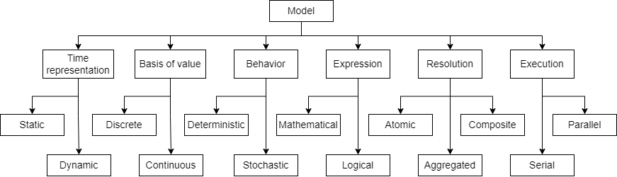

.. toctree::
   :maxdepth: 1

=============================================
State of the art in multi-modelling 
=============================================

*A Literature Review of Multi-modelling in Sustainability Transition*

29 November 2023

Introduction 
============

The urgency of today’s societal challenges, such as climate change and
unsustainable resource consumption, calls for large-scale sustainability
transitions. Sustainability transitions are interdisciplinary, often
emerging from processes within complex socio-technical systems
characterised by continually evolving relationships and interactions
between technological and ecological factors, institutions and
infrastructure. A successful energy transition, e.g., necessitates
public buy-in, careful planning across various levels of government, and
cross-cutting coordination across the energy, buildings, transportation,
and industrial sectors.

A complex socio-technical system is also multi-scalar in nature, as its
elements have properties and processes that change quantitatively and
qualitatively with scale. These scales may be spatial, temporal,
administrative (e.g., institutional) or object related. A holistic
understanding of how the behaviour of these characteristics change and
how impacts of proposed policies cascade across domains and scales is
essential for decision-making.

The multi-domain and multi-scalar nature of sustainability transitions
results in complexity that makes human comprehension of the issues at
hand an endeavour that pushes the limits of human cognition. This
complexity demands the use of modelling and simulation (M&S) in
supporting the analysis of such systems to aid effective
decision-making. We take `B. P. Zeigler, <#_bookmark89>`__ `Muzy, and
Kofman <#_bookmark89>`__ (`2018 <#_bookmark89>`__)’s definition of a
*model* as a set of instructions, rules, equations, or constraints that
represent a real-world system, such that given an initial state setting,
a model accepts input trajectories and generates corresponding output
trajectories. M&S methods allow one to abstract a real-world system and
approximate its behaviour in a controlled environment and within an
experimental frame, facilitating a more holistic understanding of the
system and thus what is required to answer a question or tackle a
challenge.

With that said, single models are often insufficient to represent the
full complexity of designing and implementing sustainability
transitions. The diverse nature of the interacting components within
socio-technical systems can be so unlike each other that they are better
abstracted and modelled using different modelling methodologies and at
different scales. However, it is challenging to encapsulate this
complexity cost-effectively and credibly within a single model. Attempts
have been made to develop unified, monolithic models that capture all
such aspects in a single model. These often inadvertently result in
inefficient and potentially incomprehensible models (`Voinov &
Shugart <#_bookmark78>`__, `2013 <#_bookmark78>`__).

One way to avoid the challenges of solely relying on single models is to
use multi-models. In this review, we define a *multi-model* as a
composition of multiple (stand-alone) models, each of which may use a
modelling methodology and scale most well-suited to capture relevant
aspects within the system of interest. These models or sub-models are
configured to interact with one another to exchange information that
influences one another and the overall multi-model outputs.

The benefits of multi-models are well-established in literature. They
can provide the users with deeper insight into the system being studied
(`Yilmaz & Oren <#_bookmark87>`__, `2005 <#_bookmark87>`__) while
increasing the productivity and quality of the sub-models (`Mosterman &
Vangheluwe <#_bookmark54>`__, `2004 <#_bookmark54>`__). Multi-models,
complex in their nature, can adequately reflect the corresponding level
of real-world complexity (`DeRosa, Grisogono, Ryan, &
Norman <#_bookmark33>`__, `2008 <#_bookmark33>`__) and are key to
achieving the requisite holistic quality of socio-technical systems
modelling (`Wu, Fookes, Pitchforth, & <#_bookmark84>`__
`Mengersen <#_bookmark84>`__, `2015 <#_bookmark84>`__).

The urgency of the societal challenges at hand often requires models
that can be used as soon as possible. This need is often incongruent
with the resource- and time-intensive nature of developing new models.
Producing fit-for-purpose models from scratch often takes months or even
years. This prohibitively costly nature of the model development process
is one barrier that limits the mainstream use of M&S for
decision-making. This limitation can be addressed with the reuse of
existing models. Aside from the fact that such models can be “ready to
go” with potentially minor modifications or fine-tuning, these models
are also already embedded with valuable domain knowledge that can
immensely benefit problem owners (`Kasputis & Ng <#_bookmark47>`__,
`2000 <#_bookmark47>`__).

Reuse of previously established and validated models can additionally
increase the authority of multi-model simulations. An example of reusing
models in a multi-model configuration can be found within the Dutch
energy transition context: To better gather insights on future energy
infrastructure needs across sectors, decarbonisation objectives are
input into the Energy Transition Model (ETM), which generates energy
supply and costs scenarios across different Dutch sectors. These
scenarios then inform the constraints of the OPERA model (`van
Stralen, <#_bookmark76>`__ `Dalla Longa, Dani¨els, Smekens, & van der
Zwaan <#_bookmark76>`__, `2021 <#_bookmark76>`__), an energy system
optimisation model that then calculates future infrastructure
requirements. That these models were previously used by government and
industry stakeholders further lends credence to the final multi-model
and its outputs. Various similar examples exist, all of which support
our motivation to focus this research on reusing existing models,
typically independently developed and intended for use as stand-alone
models, in multi-model configurations.

Unfortunately, many barriers hinder the mainstream practice of model
reuse. A multi- modeler may search for and find multiple models that
together appear to represent their system of interest, only to find that
the combination of models constitutes various modelling methods, scales,
and scopes, all resulting in a lack of interoperability between the
models. A reaction from the modeller may be to resort to heuristics in a
bid to achieve multi-model interoperability. After cobbling together
technical, ad-hoc solutions to make the models communicate with one
another, they find that their extensive efforts have resulted in a
multi-model that is misaligned in terms of semantics, concepts or
contexts (`Yilmaz <#_bookmark86>`__, `2004 <#_bookmark86>`__). As
`Diallo, Padilla, and Tolk <#_bookmark34>`__ (`2010 <#_bookmark34>`__)
discuss, “the issue with the consistent application of heuristics to
solve interoperability (is that) the resulting process might not be
interoperability”.

After multi-model interoperability is established, users are tasked with
appropriately managing model uncertainties. Model uncertainties can
significantly impact the dynamics of transitions within complex system
models. This is because achieving successful transitions within complex
systems is often characterised as wicked problems (`Rittel &
Webber <#_bookmark68>`__, `1973 <#_bookmark68>`__), given the numerous
ways to approach the problem and the involvement of many actors with
multiple, often competing, perspectives. Furthermore, complex systems
are often characterised by open and uncertain processes (`K¨ohler et
al. <#_bookmark48>`__, `2018 <#_bookmark48>`__) and unanticipated
exogenous events, all of which impact the dynamics of change represented
in the model. These aspects show that rigorous uncertainty analysis
approaches are required when using multi-models for decision support.

There are various steps that a modeller must take in order to ensure
that meaningful output can be extracted from multi-scale and
multi-domain models. It is necessary to understand the functions
required to make the inputs and outputs of different models sufficiently
consistent for information exchange. Subsequently, the modeller must
understand how the manufacturing of this interoperability interacts with
model uncertainties and impacts model outputs and interpretation. We
posit that such solutions will emerge from evaluating multi-model case
studies that are purposefully designed to span multiple domains and
scales. These case studies, composed of interacting socio-technical
system models, will build upon foundational M&S theory and form the
backbone of this research.

The societal need for effective, scientific and practicable methods for
reusing existing models in multi-model configurations is clear. The
isolated manner in which singular models have until now been developed
and used to aid decision-making demonstrates not just an inefficient use
of resources but also missed opportunities to bridge multi-scale
perspectives and multi-disciplinary expertise. Furthermore, the
transition challenges of today surpass the scope of existing individual
models, precluding the ability for more holistic problem-solving. The
need to leverage the potential of multi-modelling as a decision-support
tool to stimulate successful sustainability transitions motivates this
research proposal. Thus, the following sections of this document present
an effort to establish a clear understanding of past work on
sustainability transitions, multi-modelling, model reuse.

Sustainability Transitions in Socio-technical Systems
=====================================================

In recent decades, it has become apparent that unsustainable resource
consumption and production threaten the balance of our existing
ecological, social and technological systems. This has prompted
increasing calls for substantive transitions that bring about profound
structural shifts towards sustainability in society (`Berkhout, Smith, &
Stirling <#_bookmark22>`__, `2004 <#_bookmark22>`__). However, it is
understood that relevant strategies cannot be achieved solely through
the incremental development of innovative technologies, nor can
solutions be purely technical or purely social (`Savaget, Geissdoerfer,
Kharrazi, & Evans <#_bookmark71>`__, `2019 <#_bookmark71>`__). There is
a need for sustainability transitions within the socio-technical
contexts that we live in.

`de Haan et al. <#_bookmark32>`__ (`2014 <#_bookmark32>`__) describes
socio-technical systems as consisting of technologies entrenched within
social, political and economic contexts. Socio-technical systems are
complex systems made distinct by the non-linear processes, feedback
loops, hierarchies, and self-organising characteristics they represent.
Transitions within socio-technical systems are affected by path
dependencies, multi-scale emergent effects, and pressures by actors and
processes within the system to remain bound to the status quo.
Therefore, ‘socio-technical’ refers to the characteristics of and
interactions between social and technological elements, while
‘transition’ refers to the processes and interactions that stimulate
fundamental change in and between these elements.

In our review, we found that a substantial volume of transitions
research is based on qualitative frameworks which aim to capture the
complexity of sustainability transitions (`K¨ohler et
al. <#_bookmark49>`__, `2019 <#_bookmark49>`__). Theoretical frameworks
such as the Multi-Level Perspective (MLP) (`Geels <#_bookmark39>`__,
`2002 <#_bookmark39>`__; `Rip, <#_bookmark67>`__ `Kemp, et
al. <#_bookmark67>`__, `1998 <#_bookmark67>`__) and the Technological
Innovation System (TIS) approach (`Hekkert, Suurs, <#_bookmark42>`__
`Negro, Kuhlmann, & Smits <#_bookmark42>`__, `2007 <#_bookmark42>`__)
take a systemic perspective better to understand the tensions between
change and stability in society. Beyond these conceptual frameworks,
`K¨ohler et <#_bookmark48>`__ `al. <#_bookmark48>`__
(`2018 <#_bookmark48>`__)’s literature review showed that transitions
research hosts a growing number of studies that employ computational
modelling methods as an analytical tool. For example, the study by
`Walrave and Raven <#_bookmark81>`__ (`2016 <#_bookmark81>`__) presents
an integration of the MLP and TIS frameworks into a system dynamics
model for analysing transition pathways under various resourcing
conditions.

`K¨ohler et al. <#_bookmark48>`__ (`2018 <#_bookmark48>`__) defines
‘transition models’ as the application of existing formal modelling
methodologies to explain the dynamics of transitions. The same authors
identify the following types of models used in transitions modelling:
complex systems models (e.g., complex network models), evolutionary
economics models, energy-economy and integrated assessment models, and
socio-ecological systems modelling. Though approached and implemented in
different ways, these strands of models demonstrate a common
requirement, which is the ability to represent characteristics of
complex systems (e.g., non-linear processes, heterogeneity of model
elements and processes), normative aspects of change, path dependencies,
and the potential effects of open, uncertain processes within a single
model.

The need to represent multi-scale dimensions in transition models is
also mentioned by `K¨ohler et al. <#_bookmark48>`__
(`2018 <#_bookmark48>`__). In a separate publication, `Savaget et
al. <#_bookmark71>`__ (`2019 <#_bookmark71>`__) found agreement in the
literature that sustainability initiatives should take place at local
levels, given the differentiation of requirements and opportunities
across regions. Nevertheless, `Geels <#_bookmark40>`__
(`2004 <#_bookmark40>`__) situates the appropriate analysis at the
intermediate ‘meso’ level, bridging between ‘macro’ (e.g.,
social-ecological-economic interactions) and ‘micro’ (e.g., individual
choices and perspectives) contexts. The need for transition models to be
able to represent multiple scales thus becomes evident.

From this review, we found that using computational models to study
transitions in socio- technical systems can be improved to capture
better the characteristics of complex systems (e.g., non-linearities,
uncertainties, and multi-scale aspects). This substantiates our
understanding that multi-modelling is an appropriate approach to
studying transitions in socio-technical systems and can benefit the
field of transitions research.

Types of Multi-modelling
========================

As demonstrated above, transition models are intended to reflect complex
objects, processes, and interactions across multiple domains and scales
in the real world. This requirement makes multi-modelling a promising
approach for developing transition models. In earlier decades, research
on multi-modelling was advanced significantly in operational research,
primarily for military applications. However, our review showed that in
recent years, multi-modelling studies have extended to many other
fields, such as supply chain management and industrial ecology.

Although `Bollinger, Nikoli´c, Davis, and Dijkema <#_bookmark24>`__
(`2015 <#_bookmark24>`__)’s publication is situated in the field of
industrial ecology, we find that the concept of a multi-model ecology
put forth by the authors to be generalisable. A multi-model ecology is
defined as an interacting group of models co-evolving with one another
in a dynamic socio-technical environment. This ecology can transform
over time as knowledge and practices evolve, and it may contain mental,
conceptual, and computational models of multiple scales, scopes and
perspectives. These exist alongside and interact with actors, data,
information, and knowledge. As noted by `Bollinger et
al. <#_bookmark24>`__ (`2015 <#_bookmark24>`__), the resources in a
multi-model ecology can be configured and reconfigured to interact with
one another in different ways to form a more multi-dimensional
representation of the relevant system. However, as will be explained in
Section `2.4 <#_bookmark7>`__, the lack of a set of practicable methods
for developing multi-models from elements within such an ecology
inhibits its further development.

As described by the original authors, the solution procedure is *“an
analytical equation or numerical algorithm that has been developed for
the set of model equations to obtain the desired results”*.

We found that multi-models can be broadly categorised as tightly-coupled
and loosely- coupled models. Tightly-coupled multi-models can be
characterised by the parallel operation of two or more sub-models, with
dynamic process interactions between the sub-models during the
simulation run that impact the intermediate states of the sub-model and
overall multi-model outputs (`Antle et al. <#_bookmark16>`__,
`2001 <#_bookmark16>`__). This interaction is similar to the Class II
hybrid model described by `Shanthikumar and Sargent <#_bookmark72>`__
(`1983 <#_bookmark72>`__), whereby the sub-models cannot be
independently solved (Figure `1 <#_bookmark6>`__).

Figure 1: Classes of hybrid models, adapted from `Shanthikumar and
Sargent <#_bookmark72>`__ (`1983 <#_bookmark72>`__).

A substantial volume of publications on multi-models is based on the
United States Department of Defense’s High-level Architecture (HLA)
standards, a widely adopted framework for tightly-coupled models. HLA is
a well-known and accepted standard (IEEE 1516-2010) to enable
interoperability and model component reuse in distributed simulations by
a comprehensive specification of attributes and relations between model
components (`IEEE Std 1516-2010 <#_bookmark44>`__,
`2010 <#_bookmark44>`__). It is intended that compliance with HLA
standards at the start of the model development process can ensure the
interoperability of multiple model components within an integrated
simulation environment. However, current practices in M&S reflect that
models are typically not developed with the consideration for potential
incorporation into a multi-model, which precludes many existing models
from being considered for reuse within an HLA framework. Furthermore,
the complexity and involvedness of HLA methods limit its accessibility
to a broader range of practitioners (`Falcone, Garro, Anagnostou, &
Taylor <#_bookmark37>`__, `2017 <#_bookmark37>`__).

On the other hand, in loosely-coupled multi-models, outputs from one
sub-model are channelled as inputs into other sub-models (`Antle et
al. <#_bookmark16>`__, `2001 <#_bookmark16>`__). Such a system comprises
two or more stand-alone sub-models that can be run independently without
the presence of the other sub- models. This type of multi-model can
allow (but does not require) dynamic process interactions in between the
sub-models. The variables in such models are distinct, separate and
infrequently interact or overlap across sub-models (`Orton &
Weick <#_bookmark59>`__, `1990 <#_bookmark59>`__). These characteristics
suggest that any existing model can (theoretically) be considered for
loose-coupling, thereby reaping the benefits of model reuse described by
`Kasputis and Ng <#_bookmark47>`__ (`2000 <#_bookmark47>`__) and `Davis
and Anderson <#_bookmark29>`__ (`2003 <#_bookmark29>`__). In the
classification introduced by `Shanthikumar and Sargent <#_bookmark72>`__
(`1983 <#_bookmark72>`__), this corresponds to Class I and III/IV hybrid
models (Figure `1 <#_bookmark6>`__). The focus of this research will be
centred on loosely-coupled models.

In our review, we found many studies on the topic of loosely coupling
models: for example, `Viana, Brailsford, Harindra, and
Harper <#_bookmark77>`__ (`2014 <#_bookmark77>`__) and `Morgan, Howick,
and Belton <#_bookmark53>`__ (`2011 <#_bookmark53>`__) present methods
for combining Discrete Events Simulations (DES) and System Dynamics (SD)
models; `Swinerd and McNaught <#_bookmark75>`__
(`2012 <#_bookmark75>`__) present three classes of SD/Agent-based
modelling (ABM) hybrid models; `Borschev <#_bookmark25>`__
(`2013 <#_bookmark25>`__) discussed six common architectures to combine
SD, DES, and ABM models. There is an abundance of piecemeal studies in
various domains that demonstrate methods and theories for coupling
models of multiple modelling methodologies. However, we identified a
lack of a systematic framework or generalised set of methods to guide
the process of loosely coupling models.

Reusing Models
==============

The availability of composable, reusable and interoperable models is an
important factor in mainstreaming the practice of multi-modelling. In
theory, coupling such models to create multi-models is potentially more
feasible, economical, and easily validatable. In our review of these
concepts, we observed that many publications on reusing models are also
related to model composability and interoperability. We draw definitions
of the stated terms from reviewed literature:

-  Model composability refers to the degree to which model components
   can be selected and assembled in various combinations into simulation
   systems to satisfy specific user requirements (`Petty &
   Weisel <#_bookmark63>`__, `2019 <#_bookmark63>`__),

-  Model reusability refers to the degree to which a model is capable of
   being used again or repeatedly (`Balci, Arthur, &
   Ormsby <#_bookmark18>`__, `2011 <#_bookmark18>`__),

-  Model interoperability refers to the ability of two or more
   sub-models to exchange information and meaningfully use the
   information exchanged (`Diallo et al. <#_bookmark34>`__,
   `2010 <#_bookmark34>`__).

Composability refers to a property of a model made up of a combination
of multiple com- ponents parts. These components are designed and
developed to be a part of a whole model, rather than used as stand-alone
models. This differs from the anticipated scope of this research, which
focuses on reusing stand-alone, complete models in a multi-model
configuration. However, composable models host qualities which make them
conducive for reuse (`Kasputis & Ng <#_bookmark47>`__,
`2000 <#_bookmark47>`__). One such quality is related to consistency:
the development of composable model parts requires complete descriptors,
which eases the understanding of a model’s underlying workings, and thus
the selection of models that are consistent with one another.

The model development practices implemented by the original developers
significantly im- pact the reusability of a model.
`Yilmaz <#_bookmark86>`__ (`2004 <#_bookmark86>`__) notes that the
original context of the model must be explicated and made clear for
successful model reuse. Furthermore, there must be a clear separation of
factors that influence simulation outcomes, distinguishing contextual
factors from other factors and explicating distinct experimental frames.
The term *experimental frame* was first coined by `B.
Zeigler <#_bookmark88>`__ (`1976 <#_bookmark88>`__) to formally describe
a model’s context to provide repro- ducible experiment descriptions. It
specifies the conditions under which the modelled system is observed and
experimented and represents an operational formulation of the objectives
that motivate an M&S project. A model’s composability and reusability
can be improved by clearly characterising and clarifying the difference
between the model context and the experimental frame
(`Yilmaz <#_bookmark86>`__, `2004 <#_bookmark86>`__).

Unfortunately, the practice of building highly composable (and therefore
potentially reusable) models is challenging to implement. When
practitioners develop models, they typically do not set out with
composability as an objective, as it is a costly endeavour that scarcely
rewards the model developers (`Davis & Anderson <#_bookmark29>`__,
`2003 <#_bookmark29>`__). Furthermore, the fitness for purpose or
validity of the selected model is challenging to assess when the model
is built for one purpose and attempted to be reused for another, or when
it is linked to models developed under a misaligned or conflicting set
of assumptions (`Pidd <#_bookmark64>`__, `2002 <#_bookmark64>`__). The
resulting consequence on the prospects of model composability is aptly
noted by `Kasputis and Ng <#_bookmark47>`__ (`2000 <#_bookmark47>`__):
“Unless models are designed to work together, they don’t (at least not
easily and cost-effectively).”

A model’s reusability depends not just on its composability but also on
the technical ability and knowledge of future model users and the reuse
mechanisms available. Table `1 <#_bookmark8>`__ expands upon these reuse
strategies, with the left column summarising the technical aspects that
must be addressed in effective model reuse strategies as outlined by
`Pidd <#_bookmark64>`__ (`2002 <#_bookmark64>`__), while the right
column establishes how these aspects contribute to model reuse.

*Table 1:* *Technical aspects in model reuse
strategies,*\ `Pidd <#_bookmark64>`__\ *(*\ `2002 <#_bookmark64>`__\ *)*

+--------------------------------------+-------------------------------+
| Technical aspects                    | Objective                     |
+--------------------------------------+-------------------------------+
| Abstraction, for the efficient and   | To assess the substantive     |
| adequate conveyance of the model’s   | interoperability of different |
| purpose, nature and behaviour.       | model components.             |
+--------------------------------------+-------------------------------+
| Selection, as in directory and       | To support model search and   |
| search services for locating,        | selection.                    |
| comparing, and selecting models.     |                               |
+--------------------------------------+-------------------------------+
| Specialisation, as in features for   | To support modification of    |
| specialising model components into   | the model components such     |
| useable entities.                    | that they fit within the      |
|                                      | multi-model configuration.    |
+--------------------------------------+-------------------------------+
| Integration, refers to a framework   | To support the linking of     |
| (or an agreed architecture) to       | model components and          |
| combine and connect model com-       | facilitating model            |
| ponents.                             | interoperability.             |
+--------------------------------------+-------------------------------+

The abstraction and selection strategies are expanded upon by `Isasi,
Noguer´on, and Wij- <#_bookmark45>`__ `nands <#_bookmark45>`__
(`2015 <#_bookmark45>`__), who explain that ontologies and hierarchies
rich in syntax, semantics and structure are required to capture model
documentation for automation of model search and selection. This
documentation should be stored and searchable within a model reference
library alongside the models. Furthermore, the model reusers should be
skilled in valid and credible methods to facilitate interoperability
between the selected models within a coherent workflow and assess the
impacts of those methods on model outputs.

Furthermore, we observed that the reuse of models is also rooted in
social processes and considerations. Social factors can influence the
perception of validity and, hence, the reusability of a model. As an
example, the Dynamic Integrated Climate-Economy (DICE) and Regional
Integrated Climate-Economy (RICE) models quantified the impacts of
climate policies on the economy, which was considered a breakthrough at
the time of development (`Nordhaus <#_bookmark57>`__,
`1992 <#_bookmark57>`__; `Nordhaus & Yang <#_bookmark58>`__,
`1996 <#_bookmark58>`__). The author, William Nordhaus, was awarded a
Nobel Prize for his work. The simplicity of the models can be considered
a factor that supports its wide-ranging use but also exacerbates its
contention amongst climate economists. Despite heavy criticisms of such
models and integrated assessment models in general
(`Storm <#_bookmark73>`__, `2017 <#_bookmark73>`__), these models remain
widely used in research on climate economics and policies, as well as by
authoritative governmental actors such as the United States
Environmental Protection Agency.

Figure 2: Relations between the composability, interoperability, and
reusability of a model.

Our review found that the distinction between composability,
reusability, and interoperability is nuanced. Figure `2 <#_bookmark9>`__
summarises our understanding of the relations between these three
properties based on this literature review. In essense, model
reusability is dependent on how easily it can be made interoperable with
other models, as well as on the availability of verifiable methods for
meaningfully using and linking the models as well as the available
infrastructure (such as model reference libraries). The reusability of a
model also depends on its composability, as a more composable model is
more easily made interoperable with other models and is, therefore, more
reusable. However, a reused model may not be composable, and a
composable model may never be reused.

As demonstrated in this section, we found that the most relevant
literature dates back to approximately 10-20 years ago. These
foundational publications addressed conceptual requirements for
developing methodologies and standards to mitigate the intricacies of
developing reusable models. However, in surveying more recent
literature, we did not find a concrete realisation of these
methodologies or standards. Our review revealed a lack of practical
guidelines or methods for systematically approaching the reuse of
models, whether as a stand-alone model or within a multi-model
configuration.

Challenges in Multi-modelling
=============================

Guidelines for systematically approaching model reuse must address the
challenges of multi- modelling. These challenges are fundamentally
rooted in the varied nature of the modelling methodologies used, which
directly influence (individual) model characteristics. The taxonomy by
`Lynch and Diallo <#_bookmark51>`__ (`2015 <#_bookmark51>`__) suggest
that there are six key simulation model characteristics: time
representation, the basis of value, behaviour, expression, resolution,
and execution (Figure `3 <#_bookmark11>`__). These characteristics are
described to be mutually exclusive, and the presence of multiple such
competing characteristics within one multi-model triggers
interoperability challenges.

Figure 3: Taxonomy of model characteristics (`Lynch &
Diallo <#_bookmark51>`__, `2015 <#_bookmark51>`__), as adapted by the
authors from `Sulistio et al. <#_bookmark74>`__
(`2004 <#_bookmark74>`__)

Furthermore, uncertainty analysis for multi-models is an essential
dimension of this research. While there is a rich repository of
knowledge on managing and understanding uncertainties in singular
models, it is still unclear how sub-model uncertainties influence
overall multi-model outputs. As `Davis and Anderson <#_bookmark29>`__
(`2003 <#_bookmark29>`__) hinted, these uncertainties may “propagate in
trouble- some and non-intuitive ways”. This behaviour is further
influenced by the various techniques used to make the sub-models
interoperable. Understanding this topic is essential for the
interpretability and credibility of the multi-model as a
decision-support tool. Thus, we also reviewed and summarised the
literature on uncertainty analysis for multi-models.

Interoperability
----------------

Multi-models consist of sub-models that are (typically) conceived with
different modelling methods and experimental frames, giving rise to
interoperability concerns. The operational principles that distinguish
these modelling methods relate to the mathematical compatibility of the
model components and must be treated accordingly. There are practical
issues that impact interoperability when connecting models with
different mathematical representations.

There are various frameworks that structure model interoperability in
literature. We find the earlier categorisation by `Dahmann, Salisbury,
Barry, Turrell, and Blemberg <#_bookmark28>`__ (`1999 <#_bookmark28>`__)
to be most helpful: they identify two categories of simulation
interoperability, which are the technical (syntactic) and the
substantive (semantic). This categorisation can be seen as a coarser
version of `Wang, Tolk, and Wang <#_bookmark82>`__
(`2009 <#_bookmark82>`__)’s Levels of Conceptual Interoperability Model
(LCIM) (Figure `4 <#_bookmark13>`__), whereby technical interoperability
corresponds to LCIM levels 1 and 2, and substantive interoperability
corresponds to LCIM levels 3 through 7.

The different characteristics of the chosen modelling approaches have
immediate consequences for the technical interoperability of the model.
The different time representations and bases of value in the models
result in different forms of model inputs and outputs. These differences
must be reconciled for the sub-models to communicate. For example, a
dynamic simulation model may produce time-series outputs that must be
transformed into static representations before being communicated to an
optimisation model.

   .. image:: images/img4.png

*Figure 4: The Levels of Conceptual Interoperability Model (*\ `Wang et
al. <#_bookmark82>`__\ *,*\ `2009 <#_bookmark82>`__\ *)*

The technological and social phenomena pertinent to socio-technical
systems exhibit behaviours relevant at different scales and resolutions.
Naturally, then, different sub-models are conceived at different scales.
Various studies often ascribe different definitions to the word ‘scale’
(`Bar-Yam <#_bookmark21>`__, `2004 <#_bookmark21>`__;
`Febres <#_bookmark38>`__, `2018 <#_bookmark38>`__). In this review, we
define scale as the extent (or dimension) of the aspects of the original
system represented in the model. For example, a wind farm model may
simulate the wind energy generation from all wind farms in the
Netherlands for the next ten years. In this case, we say that the
geographical scale of the model is the Netherlands, and the time scale
of the model is ten years. Scale is often temporal or spatial, but it is
not limited to those. For example, a biological system model may be at a
scale of cell, tissue, organ or beyond.

Current literature demonstrates that scale and resolution are important
aspects of M&S that affect technical and substantive interoperability.
This has been addressed not just in `Lynch and <#_bookmark51>`__
`Diallo <#_bookmark51>`__ (`2015 <#_bookmark51>`__)’s taxonomy of
multi-modelling but also in the sheer volume of publications on the
meaning, challenges, and solutions related to multi-resolution studies.
For elements of different scales and resolutions to communicate,
aggregation and disaggregation functions are needed to make the
communicated information consistent with one another. Aggregation has
been described as a bottom-up approach where elements of a model are
grouped and described on a higher level of abstraction (`Iwasaki &
Simon <#_bookmark46>`__, `1994 <#_bookmark46>`__), while disaggregation
refers to a top-down approach where system elements are broken into a
set of smaller elements of subsystems (`Alfaris, <#_bookmark17>`__
`Siddiqi, Rizk, Weck, & Svetinovic <#_bookmark17>`__,
`2010 <#_bookmark17>`__).

Multi-resolution modelling (MRM), sometimes called variable-resolution
modelling, is the practice of building a single model or a family of
models to describe the same phenomena at different levels of resolution
(`Davis & Bigelow <#_bookmark30>`__, `1998 <#_bookmark30>`__). While
this research is not focused on multi-resolution modelling, the concepts
driving MRM research apply to multi-modelling research. Namely, a
motivation for MRM is that both high- and low-resolution models play
important roles in using M&S for decision-support. As discussed by
`Davis and Bigelow <#_bookmark30>`__ (`1998 <#_bookmark30>`__),
high-resolution models may be well-suited to understand and demonstrate
bottom-up, emergent phenomena and are often perceived to exhibit higher
(better) fidelity. They are also increasingly feasible to implement,
given the increasing proliferation of detailed and open data. However,
high-resolution models are computationally expensive and time-consuming
to execute. Such models also typically leave important determinants of
higher-level behaviours as implicit (rather than explicit) qualities. On
the other hand, low-resolution models provide higher interpretability,
require lower computation cost, and explicate important higher-level
behaviours. These qualities make low-resolution models important tools
for exploratory analysis. Jointly, these models may be used for
cross-validation and to extract findings that cannot be provided by a
single model alone.

Past research has put forth a set of tools and techniques that can
systematically transform a model across multiple levels of resolution.
`Paul and Hillestad <#_bookmark61>`__ (`1993 <#_bookmark61>`__) propose
a set of tools for transforming a model across multiple resolutions,
namely via Selected Viewing, the use of alternative sub-models (e.g.,
surrogate models or meta-models), and Integrated Hierarchical Variable
Resolution (IHVR) modelling. `Davis and Bigelow <#_bookmark30>`__
(`1998 <#_bookmark30>`__) proposed using array formal- ism or vectors, a
method to simplify the model structure and rewrite the model in terms of
array operations, to reveal differing sets of object classes that
potentially ease the mapping of objects across scales.

Resolving technical interoperability issues related to diverse modelling
methods and scales is but the first challenge of achieving adequate
multi-model interoperability. The LCIM model demonstrates four other
levels of interoperability (i.e., semantic, pragmatic, dynamic, and
conceptual) that are necessary for a multi-model to be entirely correct.
However, establishing these types of interoperability between models is
a challenge that has been discussed by many authors such as
`Yilmaz <#_bookmark86>`__ (`2004 <#_bookmark86>`__), `Davis and
Tolk <#_bookmark31>`__ (`2007 <#_bookmark31>`__) and `Balci et
al. <#_bookmark19>`__ (`2017 <#_bookmark19>`__). The model development
process is such that a sub-model can contain many ‘hidden’ assumptions
that will impact the behaviour of other interacting sub-models.
Unfortunately, these assumptions are often not explicated and can result
in misalignments between sub-models that obstruct full substantive
interoperability. We note that the methods found and discussed in
existing literature do not adequately guide a user in systematically
approaching these interoperability concerns related to model reuse in
multi-models.

Uncertainty Analysis
--------------------

Complex systems models often incorporate relatively high levels of
uncertainty (relative to engineering models of physical systems, for
example). This is because complex systems models often incorporate
non-linear simulation methods and allow for contingencies and
uncertainties. While this flexibility may reflect increased realism, it
results in high levels of uncertainty in the generated outputs. It is
important to understand and adequately manage these model uncertainties
as part of the model verification and validation procedure. Model
verification entails determining if an implemented model is consistent
with its conceptual specification. It answers the question, “did we
build the model right?” On the other hand, model validation entails
establishing that the behaviors of the model and the real system are
sufficiently aligned within the experimental frame. It answers the
question, “did we build the right model?”

Uncertainties can originate from data inputs, model structure, or model
parameters and affect model behaviour and outputs in unanticipated ways.
The dynamics of these uncertainties can affect the interpretation and
validity of model outputs, leaving room for misuse of the model
(`Saltelli et al. <#_bookmark69>`__, `2020 <#_bookmark69>`__). Misuse
occurs when, for example, modellers project an undue amount of certainty
to model outputs or when politicians make strategic use of uncertainties
in model outputs to back a preferred policy. One way to mitigate such
misuse is to increase transparency by adequately analysing and
communicating the impacts of these uncertainties.

The importance of appropriately managing model uncertainties is
heightened when the models are used to support decisions for large-scale
socio-technical transitions. This is because such decisions are likely
to have far-reaching impacts that cascade into the future. Although many
studies linking models to socio-technical transition theories aim to
provide decision support, they often fall short of doing so (`Hirt,
Schell, Sahakian, & Trutnevyte <#_bookmark43>`__,
`2020 <#_bookmark43>`__). Furthermore, transition models attempt to
reflect the character of socio-technical transitions, which is that they
are affected by open, path-dependent processes that lead to uncertain
outcomes (`K¨ohler <#_bookmark48>`__ `et al. <#_bookmark48>`__,
`2018 <#_bookmark48>`__). It is therefore important to account for
dynamics of change that can be triggered by uncertain, unknown, or
unanticipated endogenous processes and exogenous events.

Numerous studies have attempted to structure or typify these
uncertainties in model-based decision-making (`Bevan <#_bookmark23>`__,
`2022 <#_bookmark23>`__; `Kwakkel, Walker, & Marchau <#_bookmark50>`__,
`2010 <#_bookmark50>`__; `Petersen <#_bookmark62>`__,
`2006 <#_bookmark62>`__). In essence, many uncertainties arise when we
abstract a real-world system into a model (structural uncertainties) and
parameterise this model of the system (parametric uncertainties). The
uncertainties may be epistemic (due to diverging perspectives or lack of
knowledge) or ontic (as some phenomena simply cannot be neatly captured
with numbers or equations) in nature. `Pace <#_bookmark60>`__
(`2015 <#_bookmark60>`__) further identified three sources of
uncertainty in M&S: stochastic variables and processes, a lack of
accuracy and precision, and errors. Adequate analysis and management of
these uncertainties are important for understanding the dynamics of the
system and informing meaningful interpretation of model outputs.

Two ways to analyse uncertainties in M&S models are uncertainty
quantification and uncertainty characterisation. Uncertainty
quantification refers to the representation of model output uncertainty
using probability distributions (`Cooke <#_bookmark27>`__,
`1991 <#_bookmark27>`__; `Reed et al. <#_bookmark66>`__,
`2022 <#_bookmark66>`__), while uncertainty characterisation refers to
model evaluation under alternative factor hypotheses to explore their
implications for model output uncertainty (`Moallemi, Kwakkel, de Haan,
& Bryan <#_bookmark52>`__, `2020 <#_bookmark52>`__;
`Reed <#_bookmark66>`__ `et al. <#_bookmark66>`__,
`2022 <#_bookmark66>`__; `W. E. Walker et al. <#_bookmark80>`__,
`2003 <#_bookmark80>`__). A comprehensive uncertainty analysis endeavour
is often computationally expensive as it requires many runs of the model
to observe the effects of variations in model inputs and parameters on
model outputs. Such an endeavour becomes infeasible when a single run of
the model is in itself computationally costly.

The methods used to manage model uncertainties can depend on the level
of uncertainty in the system. `Pruyt and Kwakkel <#_bookmark65>`__
(`2014 <#_bookmark65>`__) describe a range of levels of uncertainty
ranging from no uncertainty to total ignorance (Figure
`5 <#_bookmark15>`__). Sensitivity analysis can be an effective way to
understand the impacts of uncertainties on model outcomes. It is defined
by `Saltelli, <#_bookmark70>`__ `Tarantola, Campolongo, and
Ratto <#_bookmark70>`__ (`2004 <#_bookmark70>`__) as the study of how
uncertainty in the output of a model can be apportioned to different
sources of uncertainty in the model input. Uncertainties can further be
understood via structured experimental designs that represent a
systematic exploration of the uncertainty space and subsequently
analysing the results using statistical or data mining methods to
understand typical system trajectories and the conditions that
facilitate them (`Bryant & Lempert <#_bookmark26>`__,
`2010 <#_bookmark26>`__; `Halbe et al. <#_bookmark41>`__,
`2015 <#_bookmark41>`__). Another method to manage unresolvable
uncertainties is exploratory modelling, a framework to explore the
implications of varying assumptions and hypotheses by means of a series
of computation experiments (`Bankes <#_bookmark20>`__,
`1993 <#_bookmark20>`__).

The presence of interactions between the sub-models complicates
uncertainty analysis in a multi-model. These interactions occur at the
interface of the sub-models, originating in the methods employed to
achieve interoperability between the sub-models
(`Drent <#_bookmark36>`__, `2020 <#_bookmark36>`__; `Nikolic
et <#_bookmark56>`__ `al. <#_bookmark56>`__, `2019 <#_bookmark56>`__).
Furthermore, repeated interactions between the sub-models can result in
a cascade of uncertainty resulting from the accumulation of individual
sub-model uncertainties and un- certainties resulting from the sub-model
interactions; this process is described in further detail by `Wilby and
Dessai <#_bookmark83>`__ (`2010 <#_bookmark83>`__).
`Drent <#_bookmark36>`__ (`2020 <#_bookmark36>`__) further found that
the multi-model configuration (whether undirected, with feedbacks across
the models or directed with no feedbacks) impacts whether the
uncertainties should be analysed for both the whole multi-model as well
as the individual sub-models or the whole multi-model only.

   .. image:: images/imag5.png

*Figure 5:* *Levels of uncertainty as structured by*\ `W. Walker,
Lempert, and
Kwakkel <#_bookmark79>`__\ *(*\ `2013 <#_bookmark79>`__\ *)*

Our literature review revealed that previous research on uncertainty
analysis in loosely- coupled multi-models is limited. Some studies
discussed and applied uncertainty management concepts. For example,
`DeVolder et al. <#_bookmark35>`__ (`2002 <#_bookmark35>`__) and `Ye et
al. <#_bookmark85>`__ (`2021 <#_bookmark85>`__) studied uncertainty
quantification for multi-scale models in the discipline of physical
sciences. However, these studies do not directly assess how sub-model
interactions or multi-model configuration influence the dynamics of
uncertainty propagation through a multi- model, nor do they discuss
methods for analyzing and interpreting such uncertainties.

Final remarks
=============

Sustainability transitions represent complex challenges that span
multiple domains and multiple scales. A promising approach for studies
on such complex systems is to use multi-models. The urgency of the
sustainability challenges at hand often requires multi-models to be used
expeditiously. The model development process is, however, resource- and
time-consuming and must be informed by sufficient domain expertise.
These factors make the reuse of existing models an appealing option for
multi-modelling. This review found that a model’s reusability depends on
the following elements:

1. **Composability of the model**: the model development process
   dictates how composable (and therefore how reusable) a model is.

2. **Model reuse mechanisms available**: mechanisms that contribute to
   model reuse include those that enable uniform model abstraction
   (e.g., for model comparison and selection), model selection (e.g.,
   from a model repository), model specialisation (e.g., to adapt
   selected models into reusable entities), and model integration (e.g.,
   for combining and connecting model components).

3. **Technical ability and knowledge of future model users**: as related
   to the previously stated model specialisation, facilitating
   interoperability between two stand-alone models requires technical
   expertise and domain knowledge from the model users.

4. **Social processes**: the perceived authority of the model and the
   model owners influences whether and how the model is reused.

This review was scoped to focus on the first two points. We found that
the practice of reusing models in multi-models can be broadly summarised
into two types of challenges. The first is on technical interoperability
issues. This task entails ensuring that information can be exchanged
between the components of a multi-model, including reconciling different
time representations, bases of value, and scales across multiple models.
The second challenge is on achieving substantive interoperability,
ensuring that the semantics, assumptions and contexts of the models are
not in conflict with one another. The process of facilitating
interoperability in between multiple models calls for scientific methods
to identify key model and data components which should communicate with
one another, as well as to modify and combine those components to answer
a modelling question.

The task of interpreting multi-model outputs follows addressing the
interoperability challenges of multi-modelling. Decisions on large-scale
sustainability transitions that result from such models are likely to
have far-reaching impacts that cascade into the future. This increases
the importance of understanding and adequately managing how
uncertainties in model inputs and model structure influence model
outputs. Comprehensive uncertainty analysis methods on the multi-model
can help meet such a need. Uncertainties in multi-model may emerge from
individual sub-model uncertainties as well as from interactions between
sub-models. Model uncertainties can originate from structural or
parametric uncertainties, which may be epistemic or ontic. An in-depth
understanding of how to manage uncertainties in the model is an integral
part of the model verification and validation procedure that impacts the
interpretation of model outputs. While there are many studies on
uncertainty analysis for individual models, addressing uncertainty
propagation in multi-models is a topic that warrants further
comprehensive research.

This document presented the reviewed literature surrounding model reuse
as related to multi-modelling, including motivations and challenges. In
summary, we found that the field of transitions research can benefit
from methodical guidelines for reusing existing models in multi-model
configurations. The practice of reusing existing models is inhibited by
the lack of practical and scientifically grounded methods for
approaching the challenges embedded in the multi-model development
process. We conclude that developing tried-and-tested methods to treat
interoperability issues and implement uncertainty analysis in
multi-models can advance the practice of multi-modelling and stimulate
the growth of multi-model ecologies in various domains. This outcome is
beneficial as multi-models can better encapsulate socio-technical
challenges’ multi-domain and multi-scale nature, leading to strengthened
decision support for socio-technical transitions.

References
==========

Alfaris, A., Siddiqi, A., Rizk, C., Weck, O. D., & Svetinovic, D.
(2010). Hierarchical de- composition and multidomain formulation for the
design of complex sustainable systems. *Journal of Mechanical Design,
Transactions of the ASME* , *132* , 0910031-09100313. doi:
https://doi.org/10.1115/1.4002239

Antle, J. M., Capalbo, S. M., Elliott, E. T., Hunt, H. W., Mooney, S., &
Paustian, K. H. (2001). Research needs for understanding and predicting
the behavior of managed ecosystems: Lessons from the study of
agroecosystems. In (Vol. 4, p. 723-735). doi: https://doi.org/
10.1007/s10021-001-0041-0

Balci, O., Arthur, J. D., & Ormsby, W. F. (2011). Achieving reusability
and composability with a simulation conceptual model. *Journal of
Simulation*, *5* , 157-165. doi: https://doi.org/ 10.1057/jos.2011.7

Balci, O., Ball, G. L., Morse, K. L., Page, E., Petty, M. D., Tolk, A.,
& Veautour, S. N. (2017).

*Model reuse, composition, and adaptation.* doi:
https://doi.org/10.1007/978-3-319-58544-4 6

Bankes, S. (1993, 6). Exploratory modeling for policy analysis.
*Operations Research*, *41* , 435-449. doi:
https://doi.org/10.1287/opre.41.3.435

Bar-Yam, Y. (2004). Multiscale complexity / entropy. *Advances in
Complex Systems*, *7* , 47-63. Berkhout, F., Smith, A., & Stirling, A.
(2004). Socio-technological regimes and transition contexts. *System
innovation and the transition to sustainability: Theory, evidence and*
*policy*, *44* (106), 48–75. doi:
https://doi.org/10.4337/9781845423421.00013

Bevan, L. D. (2022). The ambiguities of uncertainty: A review of
uncertainty frameworks relevant to the assessment of environmental
change. *Futures*, *137* . doi: https://doi.org/
10.1016/j.futures.2022.102919

Bollinger, L. A., Nikoli´c, I., Davis, C. B., & Dijkema, G. P. (2015).
Multimodel ecologies: cultivating model ecosystems in industrial
ecology. *Journal of Industrial Ecology*, *19* (2), 252–263. doi:
https://doi.org/10.1111/jiec.12253

Borschev, A. (2013). *The big book of simulation modeling multimethod
modeling*. AnyLogic North America.

Bryant, B. P., & Lempert, R. J. (2010). Thinking inside the box: A
participatory, computer- assisted approach to scenario discovery.
*Technological Forecasting and Social Change*, *77* (1), 34–49. doi:
https://doi.org/10.1016/j.techfore.2009.08.002

Cooke, R. (1991). *Experts in uncertainty: opinion and subjective
probability in science.* Oxford University Press on Demand.

Dahmann, J., Salisbury, M., Barry, P., Turrell, C., & Blemberg, P.
(1999). Hla and beyond: Interoperability challenges. In *Simulation
interoperability workshop.*

Davis, P. K., & Anderson, R. H. R. H. (2003). *Improving the
composability of department of* *defense models and simulations*. Rand.

Davis, P. K., & Bigelow, J. H. (1998). *Experiments in multiresolution
modeling (mrm)*. RAND.

Davis, P. K., & Tolk, A. (2007). Observations on new developments in
composability and multi-resolution modeling.. doi:
https://doi.org/10.1109/WSC.2007.4419682

de Haan, F. J., Ferguson, B. C., Adamowicz, R. C., Johnstone, P., Brown,
R. R., & Wong,

T. H. (2014). The needs of society: A new understanding of transitions,
sustainability and liveability. *Technological Forecasting and Social
Change*, *85* , 121–132. doi: https://
doi.org/10.1016/j.techfore.2013.09.005

DeRosa, J. K., Grisogono, A.-M., Ryan, A. J., & Norman, D. O. (2008). A
research agenda for the engineering of complex systems. In *2008 2nd
annual ieee systems conference* (pp. 1–8). doi:
https://doi.org/10.1109/SYSTEMS.2008.4518982

DeVolder, B., Glimm, J., Grove, J. W., Kang, Y., Lee, Y., Pao, K., . . .
Ye, K. (2002). Uncer- tainty quantification for multiscale simulations.
*Journal of Fluids Engineering, Transac-* *tions of the ASME* , *124* ,
29-41. doi: https://doi.org/10.1115/1.1445139

Diallo, S. Y., Padilla, J. J., & Tolk, A. (2010). Why is
interoperability bad: Towards a paradigm shift in simulation
composition.. Retrieved from
`https://www.researchgate <https://www.researchgate.net/publication/290613784>`__.net/publication/290613784

Drent, A. (2020). *Uncertainty analysis on multi-model ecologies* .

Falcone, A., Garro, A., Anagnostou, A., & Taylor, S. J. (2017). An
introduction to developing federations with the high level architecture.
IEEE. doi: https://doi.org/10.1109/WSC.2017.8247820

Febres, G. L. (2018). A proposal about the meaning of scale, scope and
resolution in the context of the information interpretation process.
*Axioms*, *7* . Retrieved from
`www.mdpi.com/ <http://www.mdpi.com/journal/axiomsArticle>`__
journal/axiomsArticle

Geels, F. W. (2002). Technological transitions as evolutionary
reconfiguration processes:

a multi-level perspective and a case-study. *Research policy*, *31*
(8-9), 1257–1274. doi: https://doi.org/10.1016/S0048-7333(02)00062-8

Geels, F. W. (2004). From sectoral systems of innovation to
socio-technical systems: Insights about dynamics and change from
sociology and institutional theory. *Research policy*, *33* (6-7),
897–920. doi: https://doi.org/10.1016/j.respol.2004.01.015

Halbe, J., Reusser, D. E., Holtz, G., Haasnoot, M., Stosius, A.,
Avenhaus, W., & Kwakkel,

J. H. (2015). Lessons for model use in transition research: A survey and
comparison with other research areas. *Environmental Innovation and
Societal Transitions*, *15* , 194–210. doi:
https://doi.org/10.1016/j.eist.2014.10.001

Hekkert, M. P., Suurs, R. A., Negro, S. O., Kuhlmann, S., & Smits, R. E.
(2007). Functions of innovation systems: A new approach for analysing
technological change. *Technological forecasting and social change*,
*74* (4), 413–432. doi: https://doi.org/10.1016/j.techfore.2006.03.002

Hirt, L. F., Schell, G., Sahakian, M., & Trutnevyte, E. (2020). A review
of linking models and socio-technical transitions theories for energy
and climate solutions. *Environmental Innovation and Societal
Transitions*, *35* , 162–179. doi:
https://doi.org/10.1016/j.eist.2020.03.002

IEEE Std 1516-2010. (2010). Ieee standard for modeling and simulation
(ms) high level architec- ture(hla): 1516-2010 (framework and rules);
1516.1-2010 (federate interface specification); 1516.2- 2010 (object
model template (omt) specification). *IEEE Std 1516-2010 (Revision* *of
IEEE Std 1516-2000)*, 1-38. doi:
https://doi.org/10.1109/IEEESTD.2010.5553440

Isasi, Y., Noguer´on, R., & Wijnands, Q. (2015). Simulation model
reference library: A new tool to promote simulation models reusability..

Iwasaki, Y., & Simon, H. A. (1994). Causality and model abstraction.
*Artificial Intelligence*, *67*, 143-194.

Kasputis, S., & Ng, H. C. (2000). Composable simulations..

Köhler, J., De Haan, F., Holtz, G., Kubeczko, K., Moallemi, E.,
Papachristos, G., & Chap- pin, E. (2018). Modelling sustainability
transitions: An assessment of approaches and challenges. *Journal of
Artificial Societies and Social Simulation*, *21* (1). doi:
https://doi.org/10.18564/jasss.3629

K¨ohler, J., Geels, F. W., Kern, F., Markard, J., Onsongo, E.,
Wieczorek, A., . . . others (2019). An agenda for sustainability
transitions research: State of the art and future directions.
*Environmental innovation and societal transitions*, *31* , 1–32. doi:
https://doi.org/10.1016/j.eist.2019.01.004

Kwakkel, J. H., Walker, W. E., & Marchau, V. A. W. J. (2010).
Classifying and communicating uncertainties in model-based policy
analysis. *Int. J. Technology, Policy and Management* ,\ *10* , 299-315.

Lynch, C., & Diallo, S. (2015). A taxonomy for classifying terminologies
that describe simula- tions with multiple models.. doi:
https://doi.org/10.1109/WSC.2015.7408282

Moallemi, E. A., Kwakkel, J., de Haan, F. J., & Bryan, B. A. (2020, 11).
Exploratory modeling for analyzing coupled human-natural systems under
uncertainty. *Global Environmental* *Change*, *65* . doi:
https://doi.org/10.1016/j.gloenvcha.2020.102186

Morgan, J., Howick, S., & Belton, V. (2011). Designs for the
complementary use of system dynamics and discrete-event simulation.
IEEE.

Mosterman, P. J., & Vangheluwe, H. (2004, 9). Computer automated
multi-paradigm modeling: An introduction. *Simulation*, *80* , 433-450.
doi: https://doi.org/10.1177/ 0037549704050532

Nikolic, I., Warnier, M. ., Kwakkel, J. ., Chappin, E. ., Lukszo, Z. .,
Brazier, F. ., . . . Palensky, P. (2019). Principles, challenges and
guidelines for a multi-model ecology. *Citation*. doi:
https://doi.org/10.4233/uuid:1aa3d16c-2acd-40ce-b6b8-0712fd947840

Nordhaus, W. D. (1992). The ‘dice’model: background and structure of a
dynamic integrated climate-economy model of the economics of global
warming.

Nordhaus, W. D., & Yang, Z. (1996). A regional dynamic
general-equilibrium model of alter- native climate-change strategies.
*The American Economic Review* , 741–765.

Orton, J. D., & Weick, K. E. (1990). Loosely coupled systems: A
reconceptualization. *Source: The Academy of Management Review* , *15* ,
203-223. Retrieved from
http://www.jstor.org/stable/258154Accessed:28/05/200805:05 doi:
https://doi.org/10.2307/258154

Pace, D. K. (2015). *Fidelity, resolution, accuracy, and uncertainty.*
doi: https://doi.org/ 10.1007/978-1-4471-5634-5 3

Paul, K. D., & Hillestad, R. (1993). Families of models that cross
levels of resolution issues for design calibration and management. In
(p. 1003-1012). doi: https://doi.org/10.1145/ 256563.256913

Petersen, A. (2006). *Simulating nature*.

Petty, M. D., & Weisel, E. W. (2019, 3). *Model composition and reuse.*
Elsevier. doi: https:// doi.org/10.1016/B978-0-12-813543-3.00004-4

Pidd, M. (2002). Simulation software and model reuse a polemic..

Pruyt, E., & Kwakkel, J. H. (2014). Radicalization under deep
uncertainty: A multi-model exploration of activism, extremism, and
terrorism. *System Dynamics Review* , *30* , 1-28. doi:
https://doi.org/10.1002/sdr.1510

Reed, P. M., Hadjimichael, A., Malek, K., Karimi, T., Vernon, C. R.,
Srikrishnan, V., . . . Thurber, T. (2022). *Addressing uncertainty in
multisector dynamics research*. Zenodo. doi:
https://doi.org/10.5281/zenodo.6110623

Rip, A., Kemp, R., et al. (1998). Technological change. *Human choice
and climate change*, *2* (2), 327–399.

Rittel, H. W., & Webber, M. M. (1973). Dilemmas in a general theory of
planning. *Policy* *sciences*, *4* (2), 155–169. doi:
https://doi.org/10.1007/BF01405730

Saltelli, A., Bammer, G., Bruno, I., Charters, E., Di Fiore, M., Didier,
E., . . . others (2020). *Five ways to ensure that models serve society:
a manifesto.* Nature Publishing Group. doi:
https://doi.org/10.1038/d41586-020-01812-9

Saltelli, A., Tarantola, S., Campolongo, F., & Ratto, M. (2004).
*Sensitivity analysis in practice: a guide to assessing scientific
models*. Wiley Online Library. Retrieved from
`www.andreasaltelli.eu <http://www.andreasaltelli.eu/>`__

Savaget, P., Geissdoerfer, M., Kharrazi, A., & Evans, S. (2019). The
theoretical foundations of sociotechnical systems change for
sustainability: A systematic literature review. *Journal* *of cleaner
production*, *206* , 878–892. doi:
https://doi.org/10.1016/j.jclepro.2018.09.208

Shanthikumar, J. G., & Sargent, R. G. (1983). A unifying view of hybrid
simulation/analytic models and modeling. *Operations research*, *31*
(6), 1030–1052. doi: https://doi.org/10.1287/opre.31.6.1030

Storm, S. (2017). How the invisible hand is supposed to adjust the
natural thermostat: A guide for the perplexed. *Science and engineering
ethics*, *23* (5), 1307–1331. doi: https://
doi.org/10.1007/s11948-016-9780-3

Sulistio, A., Yeo, C. S., & Buyya, R. (2004, 6). A taxonomy of
computer-based simulations and its mapping to parallel and distributed
systems simulation tools. *Software - Practice and* *Experience*, *34* ,
653-673. doi: https://doi.org/10.1002/spe.585

Swinerd, C., & McNaught, K. R. (2012). Design classes for hybrid
simulations involving agent-based and system dynamics models.
*Simulation Modelling Practice and Theory* , *25* , 118-133. doi:
https://doi.org/10.1016/j.simpat.2011.09.002

van Stralen, J. N., Dalla Longa, F., Dani¨els, B. W., Smekens, K. E., &
van der Zwaan, B. (2021). Opera: a new high-resolution energy system
model for sector integration research. *Environmental Modeling &
Assessment* , *26* (6), 873–889. doi: https://doi.org/10.1007/
s10666-020-09741-7

Viana, J., Brailsford, S. C., Harindra, V., & Harper, P. R. (2014, 8).
Combining discrete-event simulation and system dynamics in a healthcare
setting: A composite model for chlamydia infection. *European Journal of
Operational Research*, *237* , 196-206. doi: https://doi.org/
10.1016/j.ejor.2014.02.052

Voinov, A., & Shugart, H. H. (2013). ’integronsters’, integral and
integrated modeling. *Environmental Modelling and Software*, *39* ,
149-158. doi: https://doi.org/10.1016/ j.envsoft.2012.05.014

Walker, W., Lempert, R., & Kwakkel, J. (2013). *Deep uncertainty* (3rd
ed.). Springer. doi: https://doi.org/10.1007/978-1-4419-1153-7

Walker, W. E., Harremoes, P., Rotmans, J., Sluijs, J. P. V. D., Asselt,
M. B. A. V., Janssen, P., . . . Krauss, V. (2003). Defining uncertainty
a conceptual basis for uncertainty management in model-based decision
support. *Integrated Assessment* , *4* , 5-17. doi:
https://doi.org/10.1076/iaij.4.1.5.16466

Walrave, B., & Raven, R. (2016). Modelling the dynamics of technological
innovation systems.

*Research policy*, *45* (9), 1833–1844. doi:
https://doi.org/10.1016/j.respol.2016.05.011 Wang, W., Tolk, A., & Wang,
W. (2009). The levels of conceptual interoperability model: Applying
systems engineering principles to ms..

Wilby, R. L., & Dessai, S. (2010, 7). Robust adaptation to climate
change. *Weather* , *65* , 176-180. doi: https://doi.org/10.1002/wea.504

Wu, P. P. Y., Fookes, C., Pitchforth, J., & Mengersen, K. (2015). A
framework for model integration and holistic modelling of
socio-technical systems. *Decision Support Systems*, *71* , 14-27. doi:
https://doi.org/10.1016/j.dss.2015.01.006

Ye, D., Veen, L., Nikishova, A., Lakhlili, J., Edeling, W., Luk, O. O.,
. . . Hoekstra, A. G. (2021, 5). Uncertainty quantification patterns for
multiscale models. *Philosophical Trans- actions of the Royal Society A:
Mathematical, Physical and Engineering Sciences*, *379* . doi:
https://doi.org/10.1098/rsta.2020.0072

Yilmaz, L. (2004). On the need for contextualized introspective models
to improve reuse and composability of defense simulations. *The Journal
of Defense Modeling and Simulation*, *1* , 141-151. doi:
https://doi.org/10.1177/875647930400100302

Yilmaz, L., & Oren, T. (2005). Discrete-event multimodels and their
agent-supported activation and update. In (p. 63-72).

Zeigler, B. (1976). *Theory of modelling and simulation*. Wiley.
Retrieved from
`https:// <https://books.google.hr/books?id=M-ZQAAAAMAAJ>`__
books.google.hr/books?id=M-ZQAAAAMAAJ

Zeigler, B. P., Muzy, A., & Kofman, E. (2018). *Theory of modeling and
simulation: discrete event & iterative system computational
foundations*. Academic press.

